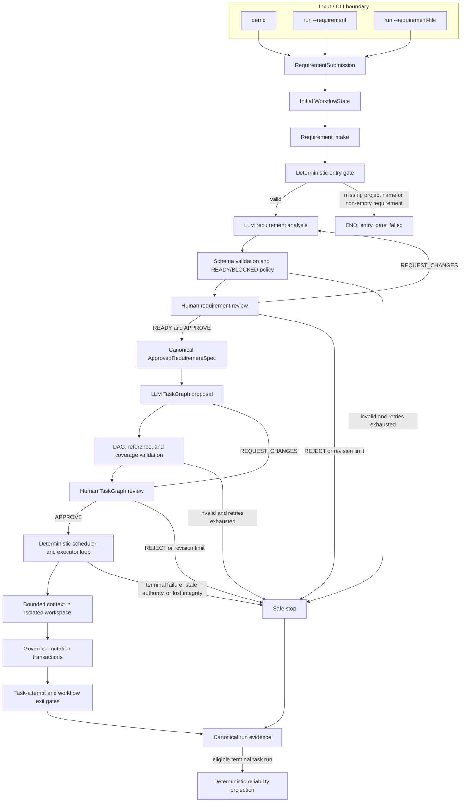
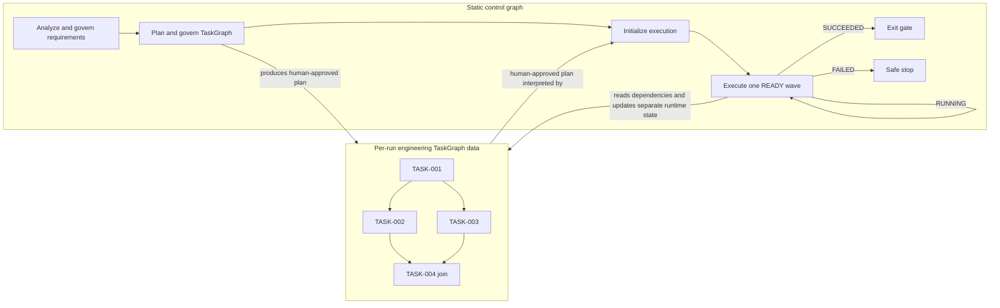
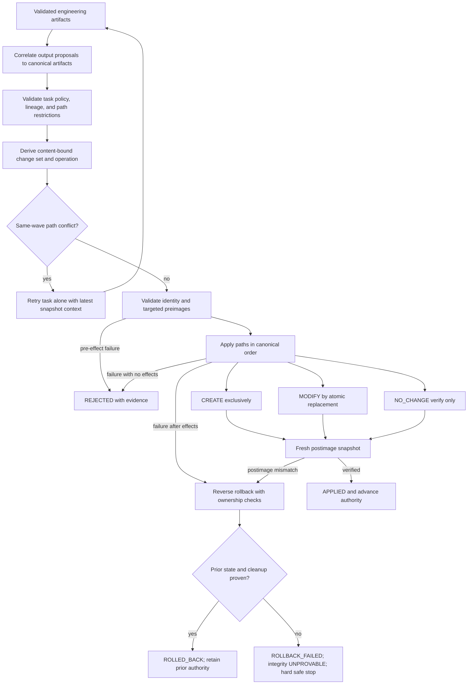

# Agentic SDLC Orchestrator Architecture

## 1. Architecture Purpose

This prototype demonstrates controlled autonomy across an engineering lifecycle. It uses LLMs where interpretation and decomposition are useful, but it does not treat generated text as authority. Deterministic application code validates proposals, humans approve the two consequential planning boundaries, and execution is confined to a run-scoped isolated workspace.

The governing idea is simple: probabilistic components propose engineering intent; deterministic controls decide what is admissible; humans authorize requirements and plans; bounded execution performs only approved work; content-bound evidence records what occurred. Governance, lineage, and failure containment are therefore architectural components, not reporting added after execution.

## 2. Architecture at a Glance

The input/CLI boundary offers a built-in `demo` choice and a `run` choice that
resolves either inline text or one UTF-8 file. All choices produce an immutable
`RequirementSubmission` before the control graph runs. That record retains the
exact original text, minimally normalized workflow text, source kind, content
hashes, and an optional safe source filename. The normalized text is mapped into
the initial `WorkflowState`; the original text remains source evidence rather than
human requirement-review feedback.

File input is read and decoded once at this boundary. During human-review resumes,
the checkpointed `WorkflowState` remains authoritative; the workflow does not
reread an external requirement file whose contents may have changed.

Requirement intake consumes the constructed state and preserves a separate
application-owned project delivery policy. Before any LLM call, the deterministic
`entry_gate` requires a non-empty project name and at least one normalized
non-empty requirement; failure ends as `entry_gate_failed`. Valid input then moves
through structured analysis, deterministic readiness, human review, canonical
specification packaging, TaskGraph planning, DAG and delivery-role validation,
and a second human review. The approved TaskGraph is interpreted by a deterministic
scheduler. Task executors reason against task-scoped requirements, accepted
dependency artifacts, structured deliverable roles, and an exact bounded
repository view. Only validated desired-file proposals can reach the mutation
layer, and only inside the workflow's isolated workspace. Completion requires the
final exit gate; safe stops retain evidence without claiming success.



## 3. Two-Graph Orchestration Model

The system has two graphs with different authority and lifetimes.

The **control graph** is the relatively stable LangGraph topology in `src/agentic_sdlc/workflow.py`. It owns lifecycle routing, bounded machine retries and human-requested revisions, interrupts, safe stops, execution-loop iteration, and the workflow exit gate. Its human checkpoints use `interrupt()` with an `InMemorySaver`; resumability is process-local and does not survive a process restart. The LLM neither creates LangGraph nodes nor rewrites routes.

The **engineering TaskGraph** is an immutable, per-run dependency DAG. The planner proposes tasks using temporary keys; application code assigns canonical `TASK-###` identities, validates dependency and requirement references, rejects cycles and missing FR/NFR/CON/AC coverage, and derives topological layers, entry-ready tasks, terminal predecessors, and synchronization points from `depends_on`. A human-approved TaskGraph is data consumed by the fixed execution loop—tasks do not become LangGraph nodes. Each task is explicitly typed as `DESIGN`, `IMPLEMENTATION`, `TEST`, `DOCUMENTATION`, `VALIDATION`, or `RELEASE`, so the DAG represents lifecycle work rather than only code generation. Structured deliverable roles and the application delivery policy are included in canonical graph identity and are visible at the existing human review gate; they grant no additional tool or filesystem authority.



This separation permits dynamic work decomposition without dynamic control-plane mutation. Dependencies and joins are explicit; independent tasks can execute together; downstream work unlocks only after every dependency succeeds. Canonical ordering, source authority, approval history, and runtime snapshots make the interpretation reproducible even when executor calls complete in a different physical order.

## 4. Governance and Authority Model

Generation is not authority. Each component receives only the authority required for its role.

| Component or record | Authority and trust boundary |
|---|---|
| `RequirementSubmission` | Immutable application-owned source evidence containing exact original and normalized input lineage; it carries no human approval authority. |
| Human requirement-review feedback | A separate additive review-lineage input used only to request a new analysis revision; it does not replace or amend the original submission record. |
| LLM analyst, planner, executor | Proposes structured analysis, task decomposition, semantic outputs, and output-to-path suggestions; cannot approve, settle tasks, assign canonical evidence identity, or mutate files. |
| Human reviewer | May `APPROVE`, `REQUEST_CHANGES`, or `REJECT` validated requirement analysis and TaskGraph candidates; a blocked analysis cannot be approved. |
| Control graph / orchestrator | Enforces routing, budgets, canonical ordering, validation, scheduling, settlement, safe stop, and exit-gate decisions. |
| `ApprovedRequirementSpec` | Canonical downstream requirement authority, deterministically packaged from the exact approved READY analysis revision. |
| `ProjectDeliveryPolicy` | Application-owned governance context, separate from business requirements; `RUNNABLE_PROJECT` requires structured entrypoint, test, and root run-guide responsibilities. |
| Approved `TaskGraph` | Human-authorized work, dependencies, references, outputs, deliverable roles, and per-task materialization policy for one source-spec identity/version and delivery policy. |
| Isolated workspace and session | The only live repository-like filesystem capability; its authoritative snapshot advances only after verified application. |
| Mutation layer | Derives and applies the restricted complete-file vocabulary `CREATE`, `MODIFY`, and `NO_CHANGE`; it does not accept an LLM-declared operation. |
| Live run evidence bundle | Application-owned output under `runs/<run-id>/sdlc-artifacts/`; Task Agents receive no path or mutation authority over it. |
| Durable delivery package | Application-published output under `projects/<name>/`; its project-content and `sdlc-artifacts/` projections are independently verified before and after promotion. |
| Authoritative Git repository | Outside autonomous execution authority. The runtime exposes no commit, branch, push, PR, merge, worktree, or promotion operation. |
| Reliability reporter | Reads terminal evidence, validates accounting, and emits a separate deterministic metrics projection; it cannot alter execution. |
| SDLC document builders and PDF renderer | Build validated, non-authoritative human-readable views from existing governed records and render them locally; PDFs are never read as workflow authority. |

TaskGraph approval includes each task's `FORBIDDEN`, `ALLOWED`, or `REQUIRED` materialization policy. That approval grants bounded execution authority only within the isolated workspace. It grants no shell, generated-code execution, deployment, or Git authority.

## 5. Requirement Authority and TaskGraph Authority

The `RequirementSubmission` is immutable source evidence. The workflow's separate
requirement-review feedback field and decision lineage are the only inputs through
which a human requests changes; they never overwrite or append to the original
submission.

Validated requirement analyses are accumulated as ordered revision records containing revision and attempt numbers, prompt/model provenance, reviewer feedback, the exact analysis, and its deterministic planning-readiness decision. `REQUEST_CHANGES` preserves the prior record, passes the human feedback into a new analysis revision, and resets only the bounded machine-attempt budget. The normal workflow creates one version-1 `ApprovedRequirementSpec` after a READY revision is approved; the package records `source_analysis_revision`, canonical item IDs and lineages, a content hash, and the exact approved text without another LLM rewrite.

Planning consumes only that specification. The resulting TaskGraph embeds its source `spec_id` and version; human TaskGraph revisions retain graph lineage and supersession. Execution validates the source-spec pair before workspace initialization and again before every execution-loop advance. A mismatch yields `STALE_TASK_GRAPH` before request construction, workspace access, or mutation.

The planner also receives a separately serialized `ProjectDeliveryPolicy`. The default `ENGINEERING_ARTIFACTS` mode preserves existing workflows. `RUNNABLE_PROJECT` deterministically requires `RUNNABLE_ENTRYPOINT`, `AUTOMATED_TESTS`, and `RUN_INSTRUCTIONS` coverage on REQUIRED-materialization tasks. Each task carrying `AUTOMATED_TESTS` must also expose human-reviewed `PYTHON_PYTEST` validation; `PYTHON_COMPILE` may be additional evidence but cannot substitute for executing the tests. This policy does not amend the approved requirement specification or authorize resolution of unrelated ambiguity. Executor validation binds those roles to materializable canonical SOURCE, TEST, and root `README.md` DOCUMENTATION artifacts respectively, with correctable defects using the existing bounded retry path.

The authority chain is therefore: approved analysis revision → canonical specification → validated TaskGraph → human TaskGraph approval → execution authority. An upstream authority change invalidates stale downstream planning; regeneration and governance are required before a new plan can gain execution authority. The prototype detects and stops stale execution, but it does not automatically synthesize the replacement graph.

## 6. Execution Runtime and Workspace Isolation

Runtime progress is separate from the immutable approved plan. Tasks start as `READY` when dependency-free and `BLOCKED` otherwise. The scheduler selects at most two ready tasks in canonical TaskGraph order, atomically marks the wave running, joins all authorized executor calls, and settles results deterministically. Dependency chains therefore execute as sequential singleton waves, while independent ready work can share a bounded parallel wave. A dependent becomes ready only when every declared predecessor has succeeded with complete accepted evidence.

Only `TaskExecutor.execute()` calls run in worker threads. Request building, bounded repository reads, canonicalization, validation, conflict analysis, mutation, recovery categorization, and state settlement remain single-threaded. Thus engineering reasoning can overlap while audit order and filesystem mutation remain deterministic. A terminal peer failure freezes new dispatch, while already-running peers are joined and may retain valid evidence without unlocking further work.

The live CLI injects an application-owned progress reporter into this orchestration
boundary. The orchestration thread reports execution start, canonical wave
membership, executor completion, and settled outcomes. A bounded five-second wait
emits a heartbeat only while executor futures remain incomplete; completed results
are still consumed, validated, mutated, and settled in canonical TaskGraph order
rather than physical completion order. Worker threads never render output. The
reporter is a no-op for callers that do not supply one, and reporter failure cannot
alter execution authority. These events are ephemeral UI only: they do not enter
workflow state, the canonical trace, checkpoints, SDLC artifacts, manifests, or
reliability metrics, and they do not imply percentage completion. After TaskGraph
approval, no additional keyboard input is required unless the workflow presents a
new explicit governance interrupt.

Each task can make at most three attempts. Application policy—not the LLM—classifies a constrained set of provider, correlation, semantic-validation, materialization, conflict, and mutation failures as retryable. A retry re-executes the same approved task with application-owned feedback and a new deterministic request/attempt identity. There is no hidden SDK retry, delay/backoff, or fallback model/provider. The only execution fallback is bounded serialization after a same-wave write conflict: conflicting tasks consume retry budget and rerun one at a time against the latest snapshot.

The live filesystem capability is a factory-created unique temporary directory bound by workspace ID plus root device/inode. Snapshots walk regular files without following symlinks. A governed session preserves an immutable baseline snapshot and advances an authoritative snapshot only after verified mutation. Workspaces are disposable in scope but currently retained for inspection rather than automatically deleted.

Brownfield context is deliberately bounded. An application-owned path provider selects explicit baseline, dependency-materialized, and conflict/mutation-retry paths. The executor receives exact UTF-8 contents or proven absence, hashes, and the authoritative snapshot binding—not an arbitrary path, root handle, whole-repository scan, or browsing capability. Scenario seeding copies only an explicit scenario manifest before the governed session begins.

## 7. Governed Mutation Transactions

Engineering artifacts are semantic evidence until a validated materialization proposal correlates an output ordinal to a canonical artifact and repository-relative path. The application validates task policy, artifact set, path uniqueness, lineage, and provenance, then derives a content-bound `WorkspaceChangeSet`. Complete artifact content is the desired file state: `CREATE` means the path was absent, `MODIFY` means an existing hash differs, and `NO_CHANGE` means existing content already matches. `NO_CHANGE` verifies state and performs no write.



Paths must be canonical relative POSIX paths. Absolute, drive-qualified, traversal, aliased, protected `.git`, exact `.env`, virtual-environment, reserved top-level `sdlc-artifacts/`, symlinked, special-file, and duplicate targets fail closed; `DELETE` is absent. The reservation applies at Task Agent materialization authority, not merely during export. Validation recomputes change-set identity and checks targeted optimistic preimages against the current real snapshot. This permits disjoint changes derived from one wave snapshot to apply serially even after the global snapshot advances, while stale target state is rejected.

Application is a process-level transaction: `CREATE` uses exclusive creation, `MODIFY` stages a same-directory atomic replacement while preserving mode bits, and a fresh snapshot verifies every postimage. Once effects exist, handled failure triggers reverse rollback. Created files/directories are removed and modified bytes/modes restored only if captured device, inode, content, and mode evidence still proves transaction ownership. Rollback is verified. Inability to prove cleanup or workspace integrity becomes explicit `ROLLBACK_FAILED`, marks the session `UNPROVABLE`, aborts unsettled peers, and hard-stops all further dispatch and mutation. This is not crash-consistent journaling or hostile-process isolation.

## 8. Governed Validation Execution

Required runtime validation is explicit canonical TaskGraph data, never a keyword
in task prose. A planner may select only an application-defined profile; the human
reviews that profile with the canonical graph. The closed profiles are
`PYTHON_COMPILE` and `PYTHON_PYTEST`. Task Agents receive no subprocess,
executable, argv, shell, Docker, package-manager, cwd,
environment, installer, network-command, or script authority, and
`TaskExecutionResult` cannot carry authoritative execution evidence.

Task-level validation authority and publication completeness are separate.
Approved task requirements protect each candidate mutation. Independently, the
application derives final requirements for `RUNNABLE_PROJECT` from the exact
authoritative snapshot: any Python file requires `PYTHON_COMPILE`, and Python
files below `tests/` additionally require `PYTHON_PYTEST`. An empty planner list
cannot waive these checks. Final evidence uses the existing policies/backends but
is bound to an application-owned validation identity and the final snapshot rather
than a Task Agent attempt.

The orchestration-thread sequence is:

```text
validated TaskExecutionResult and artifacts
  -> validated materialization and WorkspaceChangeSet
  -> deterministic same-wave conflict reconciliation
  -> disposable postimage from exact pre-wave authority plus this task only
  -> application-resolved governed validation policy and backend
  -> immutable correlated execution evidence
  -> PASS: apply only the governed WorkspaceChangeSet to live authority
  -> FAIL/TIMEOUT: existing bounded Task Agent recovery decision
```

Each disposable postimage has its own workspace identity and canonical snapshot
identity. The fixed backend invokes the trusted interpreter with argv equivalent
to `sys.executable -I -B -m compileall -q .`, `shell=False`, a minimal explicit
environment, disposable home/temp directories, a fixed timeout, process-group
termination, constant-memory stream hashing, and 16 KiB retained raw prefixes per
stream. Retained output is control-character escaped and remains bounded; total
byte counts, hashes, and truncation flags preserve the audit boundary.
Command-created files and
changes are discarded. The live workspace is unchanged until exact evidence for
the current run, graph, task, request, attempt, requirement, profile, policy,
source snapshot, and staged snapshot passes correlation and integrity checks.

`PYTHON_PYTEST` preserves that same settlement point but delegates to a narrow
Docker CLI backend. Application policy fixes `python:3.12-slim`, container creation,
copy, pip, pytest, timeout, network-disconnect attempt, and cleanup argv with
`shell=False`. The backend copies the exact staged postimage into `/work` without a
host bind mount, reads normalized PEP 621 dependencies from that staged snapshot,
installs only pytest plus those accepted requirements, and runs all `tests/` with
plugin autoload disabled. Archive copy preserves application ownership and
restrictive modes while the container runs under the matching application-owned
numeric user/group; the authoritative workspace is never chmodded for validation.
Provisioning and test evidence are distinct and linked;
both must correlate and pass, and container removal must be proven, before the
existing live-mutation loop can run. Same-wave peer candidates remain absent.

The Docker profile intentionally uses a mutable fixed tag and public PyPI without
locks, hashes, private indexes, caches, or per-package allowlists. It does not
install the generated project or run build hooks. It attempts bridge-network
disconnection before pytest and records the observed result, but does not claim
network denial when disconnection is unavailable. Default Docker isolation, no
host mounts/secrets/socket, dropped capabilities, no-new-privileges, and small
memory/PID bounds make this safer than host execution; they are not a production
hostile-code or supply-chain sandbox.

Docker must be installed and running for `PYTHON_PYTEST` (for example Docker
Desktop on macOS/Windows or Docker Engine on Linux). Backend unavailability fails
closed; there is no host-pytest fallback.

Normal non-zero compilation and reliably cleaned timeout outcomes may enter the
existing three-attempt Task Agent repair path with explicitly untrusted bounded
diagnostics. Backend, staging, policy, termination, cleanup, and evidence-integrity
failures are infrastructure/integrity failures and fail closed without consuming
an LLM repair retry. Progress events are observational; persisted evidence and the
task-attempt exit decision govern success.

The local backend remains safe only for narrow non-importing compilation; cwd
confinement is not an OS sandbox. Generated pytest uses the separate Docker
backend, but its prototype controls are not a claim of complete network,
child-process, CPU, memory, or hostile-code containment. The contracts continue to
separate approved requirements, policy, environment/backend, requests,
provisioning evidence, execution evidence, and settlement so stronger image,
dependency, or benchmark policies can be added without granting package-manager or
shell authority to Task Agents.

## 9. Ambiguity Governance and Governed Replanning

The ambiguity reviewer scenario starts with: “Enhance the URL shortener so shortened URLs automatically expire after a period of time.” Revision 0 identifies unresolved choices including TTL duration and start, expired redirect/analytics behavior, existing-code scope, and persistence. Because `needs_clarification=true`, deterministic readiness is `BLOCKED`; the human interrupt offers only `REQUEST_CHANGES` or `REJECT`, the planner has zero calls, and neither a specification nor TaskGraph exists.

The recorded `REQUEST_CHANGES` decision clarifies a fixed 24-hour TTL from creation, process-local storage, HTTP 404 at and after expiration, no migration, and access-time checking. Revision 1 preserves the decision lineage, becomes `READY`, and is human-approved. Only then is the exact revised analysis packaged as the authoritative specification and supplied to planning; the approved TaskGraph records that revised source identity.

This scenario demonstrates the governed replanning boundary, but Revision 1 produces the first authorized TaskGraph: Revision 0 was blocked before planning and therefore had no plan to replace. Separately, if an approved TaskGraph already exists and its source specification ID/version no longer matches the current requirement authority, source-authority validation blocks runtime initialization or the next execution-loop advance before workspace access, request dispatch, or mutation. The stale graph cannot continue to exercise execution authority; a regenerated plan requires deterministic validation and renewed human governance before it can execute.

These controls do not perform live TaskGraph topology mutation, active dependency surgery, running-task migration, cancellation, or active-DAG rewriting.

## 10. Exit Gate and Durable Project Promotion

Task success alone is insufficient. The workflow exit gate checks processed input, approved validated analysis, an approved specification, validated and approved TaskGraph evidence, `SUCCEEDED` runtime state, exact final-attempt request/result/artifact/validation chains, verified workspace integrity, complete final materialization/mutation/exit-decision evidence, and exact PASS evidence for every approved required validation. A `REQUIRED` materialization task must have passed materialization evidence and an `APPLIED` transaction; non-materializing permitted tasks still require a successful governed exit decision. For `RUNNABLE_PROJECT`, a final `ProjectReadinessValidation` additionally proves that every required role is backed by a successful final task attempt, passed semantic and materialization evidence, a validated/applied change set, and a matching path/content hash in the authoritative final snapshot; run instructions must resolve specifically to root `README.md`. The same exit-gate node—not a new LLM stage—clones that exact final snapshot and executes application-required compile and Docker pytest profiles. Missing, failed, stale, mismatched, or uncleaned final evidence blocks exit success and durable publication even when every canonical task requested zero validations.

This is an evidence-completeness and workspace-integrity boundary, not general runtime or deployment authority. Readiness separately records planner-requested task validation and application-required final-workspace validation, including the exact final snapshot identity. `PYTHON_COMPILE` verification means compilation only. `PYTHON_PYTEST` verification means governed dependencies were provisioned and generated pytest executed and passed inside the recorded disposable container; it does not prove benchmarks, deployment, production readiness, or general correctness. After the gate passes, the live CLI resolves the exact retained workspace capability and explicitly supplies the same run's terminal `LiveRunArtifactBundle` to project publication. Export request construction requires passed readiness bound to that authoritative snapshot before the exporter validates the successful manifest, exact regular-file set, hashes, byte sizes, bundle identity, run identity, and authoritative workspace lineage. It then uses descriptor-relative no-follow POSIX operations to copy the authoritative project content and evidence bundle into one staging package. Staging and final verification independently prove that the non-reserved projection equals the authoritative workspace, the `sdlc-artifacts/` projection equals the validated live bundle, and no unexplained third path set exists. Promotion reserves a new non-overwriting directory and remains relative to retained staging/destination descriptors. Export fails closed where those filesystem primitives are unavailable. The live run bundle remains retained, the durable directory is not an agent workspace, and publication does not initialize Git, deploy, or invoke CI/CD.

## 11. Traceability and Reliability Evidence

Within a workflow run, frozen Pydantic contracts make canonical plan, execution, artifact, workspace, mutation, and final project-readiness records immutable by contract, while `operator.add` state reducers accumulate histories rather than replace them. Together they retain requirement analyses and human decisions, TaskGraph candidates and approvals, execution waves, requests, results, failures, recovery decisions, canonical engineering artifacts, bounded workspace requests, snapshots, materialization validations, change sets, conflicts, mutation results, task-attempt exit decisions, and role-to-final-snapshot readiness evidence. Deterministic UUIDv5 identifiers and content hashes bind specification, graph, task, attempt, request, artifact slot, content, references, and mutation evidence. Failed attempts remain audit evidence; only the final successful attempt's exactly validated artifact set can feed dependents. The default `InMemorySaver` checkpoint is process-local, and exported JSON/Markdown reviewer artifacts are ordinary files rather than a tamper-evident durable event store.

The evaluator-facing requirement-to-code view is a presentation-neutral,
side-effect-free projection over those records. It starts with each canonical FR,
NFR, CON, and AC exactly once; follows only explicit TaskGraph references; derives
artifact and target-path lineage through exact successful final-attempt,
materialization, change-set, mutation, and exit-decision correlations; and reuses
the governed validation predicate that already checks graph, task, request,
attempt, workspace, policy, provisioning, evidence identity, and exit authority.
Logical artifact names remain semantic metadata; implementation paths come only
from validated workspace change sets. Compile and pytest evidence retain their
distinct profiles. Application-required final-workspace validation remains
run-level evidence and does not backfill an item as verified when no explicit
covering-task validation relationship exists. Brownfield lineage through the final
snapshot is shown only when baseline provenance, seeded snapshot, bounded codebase
context, approved run-level impact analysis, new specification, TaskGraph, and
final snapshot correlate exactly. The live post-export view adds publication only
when that result is bound to the same final snapshot; individual
impact-finding-to-task edges are not invented. The approved impact
analysis is traceable to the overall plan, but individual impact findings are not
yet traceable to specific tasks.

`VERIFIED`, `UNVERIFIED`, and `NOT_IMPLEMENTED` are derived traceability statuses,
not new execution or validation authority. Missing or malformed joins fail closed
and remain visible. `VERIFIED` means implementation and successful governed
validation are explicitly linked; `UNVERIFIED` means implementation exists but
the item-specific validation chain is not proven, not that implementation or tests
failed; `NOT_IMPLEMENTED` means no authoritative implementation outcome is
traceable. The projection builder performs no LLM call, filesystem access,
validation, mutation, resume, approval, or publication, and Streamlit renders it
with plain-language first-level labels while retaining exact technical evidence.

After a successful terminal state exists but before publication begins, the normal
artifact writer deterministically serializes that same projection as
`requirement_traceability.json` and `requirement_traceability.md`. The reports are
marked derived and non-authoritative, describe final readiness/snapshot evidence,
and deliberately make no publication-success claim. The existing manifest binds
both files with the rest of `runs/<run-id>/sdlc-artifacts/`; the unchanged verified
export pipeline copies the complete bundle to
`projects/<project-name>/sdlc-artifacts/`. Rendering completes before either report
is installed. A generation failure remains visible through the existing required
terminal-artifact failure path, so no manifest or publication treats a partial
report set as valid.

### Governed SDLC PDF publication

Successful terminal finalization adds an application-owned presentation pipeline:

```text
approved specification + approved TaskGraph + final governed evidence
    -> validated renderer-neutral SDLC document views
    -> narrow local ReportLab renderer
    -> four manifest-bound PDF artifacts
```

The builders make no LLM call and perform no semantic rediscovery. They copy exact
approved requirement text, canonical identifiers, explicit TaskGraph references,
final-attempt engineering lineage, governed validation argv/results/output, the
existing conservative traceability statuses, and verified brownfield provenance.
Functional and design relationships are shown only where explicit TaskGraph or
traceability edges already exist. A brownfield impact finding remains run-level
when the current model has no finding-to-task edge. The workflow diagram remains
an orchestrator diagram and is not relabeled as product architecture.

`sdlc_document_models.py` defines immutable renderer-neutral sections, entries,
fields, and tables; `sdlc_document_builder.py` validates and builds the four views;
`pdf_renderer.py` is the narrow renderer boundary; and
`sdlc_pdf_publication.py` installs the canonical snake_case set:
`requirements_specification.pdf`, `functional_specification.pdf`,
`design_specification.pdf`, and `test_plan_validation_report.pdf`. ReportLab
Platypus supplies flowing layout, repeating table headers, long-value wrapping,
page templates, and page numbers. `pypdf` is dev-only and verifies that generated
files can be parsed and searched in automated tests.

PDF generation runs only for `success`, after semantic-event reconciliation and
Human Governance History generation but before `manifest.json`. Every document is
first rendered to a temporary file. The application installs and verifies all four
or removes the entire set. A builder, renderer, partial-install, or verification
failure becomes explicit terminal evidence-finalization failure: workflow authority
is preserved, but no normal manifest or durable project export proceeds. On
success, the existing manifest automatically binds PDF hashes/sizes, the unchanged
exporter copies exact bytes into `projects/<project-name>/sdlc-artifacts/`, and the
manifest-driven Streamlit index presents human-friendly direct downloads without
removing existing evidence.

The initial view model does not claim a general typed product API/schema model,
project architecture diagram, canonical per-test-function identity, or explicit
trade-off/mitigation model because the current authority contracts do not guarantee
those structures. Missing optional evidence is labeled or omitted; it is never
filled with generated interpretation.

### Semantic run events and human governance history

The application lifecycle records a deliberately small semantic audit stream at
`runs/<run-id>/run-events.jsonl`. Each canonical JSON line carries a stable event
identity, per-run sequence, UTC recording time, actor, authority classification,
stage, correlation identifiers, bounded data, and evidence references. Sequence,
not timestamp, establishes chronology. The process-local append layer validates
the complete existing stream, rejects malformed or conflicting records, assigns
monotonic sequences, and treats an identical semantic replay as an idempotent
no-op. It provides thread safety for the current application and background
clarification model; it does not claim distributed or cross-process ordering.

This stream observes authority rather than creating it. Requirement Analysis and
TaskGraph decisions are reconciled from the authoritative review histories after
the governed transition succeeds. A failed append therefore cannot revoke a
human decision; later inspection or lifecycle advancement can repair a missing
reconstructible event without replaying the workflow. At terminal success or safe
stop, the application retries incomplete reconciliation before rendering or
freezing evidence. Reconstructible events must be retained and the derived Human
Governance History must be successfully materialized. Failure of either step
preserves workflow authority while application evidence finalization fails
explicitly; no normal manifest or successful project publication proceeds. The
initial vocabulary is limited to accepted requirement submission, brownfield
baseline selection and verification, Requirement Analysis and TaskGraph review
decisions, and AI clarification request/generation. Task attempts, validation,
rollback, publication, performance, and generic UI telemetry are intentionally
absent.

Actor and authority are separate. Human submission or baseline selection is
`HUMAN_INPUT`; an authoritative review decision is `HUMAN_GOVERNANCE`; an AI
clarification request/draft is `NON_AUTHORITATIVE_ASSISTANCE`; and verified
brownfield provenance is an `AUTOMATED_CONSEQUENCE`. The AI draft stores only
bounded generation/context metadata and a digest, cannot resume the workflow, and
cannot approve, request changes, create a revision, or authorize execution.
Human feedback remains in the authoritative review history; the event references
it by presence, digest, and review correlation rather than creating a competing
copy.

At terminal application finalization,
`runs/<run-id>/sdlc-artifacts/human_governance_history.md` is rendered
deterministically from the validated sequence plus structured authoritative
state. It labels itself derived and non-authoritative, dereferences exact human
feedback for evaluator readability, and describes only consequences supported by
approved specification, TaskGraph, revision, or safe-stop evidence. Brownfield
impact analysis is described as part of Requirement Analysis governance, not as
an invented independent approval gate. The existing manifest binds this Markdown
report and verified publication copies it normally. The live sibling
`run-events.jsonl` deliberately stays outside the frozen manifest so later event
families can append without invalidating retained artifact integrity. Neither file
is read to decide approval, resume permission, requirement or TaskGraph authority,
validation, mutation, or publication.

The repository separates storage and evidence ownership. `sample_output/` is
Git-tracked, curated reviewer/reference material; it may preserve frozen scenarios,
is not authoritative execution history, and is never a CLI or Streamlit runtime
destination. A live invocation instead derives one ignored
`runs/<run-id>/sdlc-artifacts/` directory from the existing governed run ID and
uses that application-owned directory for initial execution, approval resumes,
terminal evidence, and the static workflow diagram. At successful or safely stopped termination, an
`sdlc-artifact-manifest-v1` manifest binds run/status/policy/exit metadata to sorted
bundle-relative file hashes and byte sizes. It lists only evidence actually
present, excludes itself, and makes no signing or tamper-proofing claim. This
application-owned directory is outside Task Agent workspace and mutation
authority. Successful publication creates an ignored durable product under
`projects/<project-name>/`, retains the original run evidence, and creates a
separately manifest-verified copy at
`projects/<project-name>/sdlc-artifacts/` before final promotion. The manifest
remains an integrity index rather than a signature or tamper-proof event store.
Renaming the curated tree changes none of these execution, evidence, or publication
authority boundaries.

For a completed Streamlit presentation, the finalized manifest records drive a
read-only, lifecycle-ordered **SDLC Evidence & Artifacts** index. The adapter
offers exact retained bytes through native download controls, rejects unsafe or
content-mismatched entries, and does not enumerate unrelated directory contents.
The index is presentation metadata only and introduces no workflow, artifact,
validation, or publication authority.

`sample_output/reliability_metrics.json` is generated as a deterministic projection over the checked-in terminal `task_execution.json` and `workspace_execution.json` evidence for the curated V17 greenfield and V18 brownfield publications. The derivation validates that every started attempt has exactly one exit decision, then reports task outcomes, attempt outcomes, success ratios, retry frequency, mutation and rollback counts/frequency, and safe-stop count. It is read-only with respect to execution behavior and is not a telemetry subsystem.

End-to-end latency and MTTR are explicitly `NOT_MEASURED`: the evidence model retains structural events but not authoritative elapsed-time or incident-to-recovery boundaries. Reliability claims are made only where retained evidence supports them; no timing precision is inferred from creation timestamps or file metadata.

## 12. Architectural Decisions and Deliberate Limitations

- **No live TaskGraph mutation.** Static control topology plus governed plan regeneration favors reproducibility over runtime graph surgery.
- **No autonomous Git promotion.** Agent mutation authority ends at the isolated workspace. The application may promote an exit-verified snapshot into a new durable project directory, while branch, commit, push, review, merge, and release decisions remain outside the autonomous loop.
- **Restricted mutation vocabulary.** Complete-file `CREATE`, `MODIFY`, and `NO_CHANGE` make preimages, postimages, conflicts, and rollback defensible; arbitrary filesystem operations and `DELETE` are excluded.
- **Bounded repository reasoning.** Explicit path projections reduce context and prevent autonomous discovery, at the cost of requiring application-owned context selection.
- **Serialized mutation after parallel reasoning.** This preserves deterministic evidence and transaction ordering while still demonstrating real concurrent executor calls.
- **No unsupported timing metrics.** MTTR and end-to-end latency remain unmeasured until authoritative timing boundaries exist.
- **Prototype recovery scope.** The design is not a distributed scheduler, persistent cross-process recovery platform, crash-durable transaction manager, CI/CD system, deployment service, or remote repository manager.

## 13. Reviewer Evidence Anchors

- **V17 greenfield:** `sample_output/url-shortener-v17/` is the curated runnable publication (13 tests); its verified evidence copy is under `sdlc-artifacts/`.
- **V18 brownfield:** `sample_output/url-shortener-v18-expiration/` is the separate evolved publication (20 tests). Its `sdlc-artifacts/workspace_execution.json` binds the selected baseline to V17's project identity, originating run, publication bundle, and source snapshot.
- **Ambiguous requirement:** Requirement Analysis still exposes ambiguities and `BLOCKED`/`READY` planning readiness, with human revision establishing new authority. Evaluators demonstrate this in the live workflow; deterministic tests retain the regression coverage without a third frozen sample.
- **Reliability:** `sample_output/reliability_metrics.json` indexes deterministic measures derived from the two curated run-evidence bundles.

These evaluator copies do not alter ownership: the corresponding
`runs/<run-id>/sdlc-artifacts/` directories remain authoritative execution history,
and `projects/<project-name>/sdlc-artifacts/` remains the manifest-verified evidence
copy published with each durable product. Normal CLI and Streamlit execution never
targets `sample_output/`.
