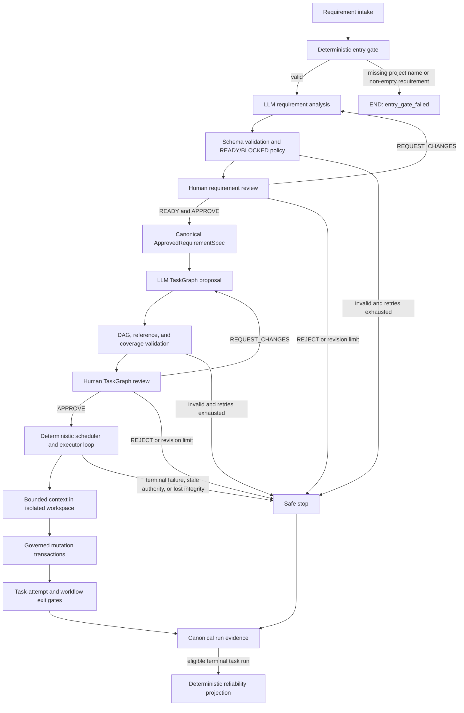
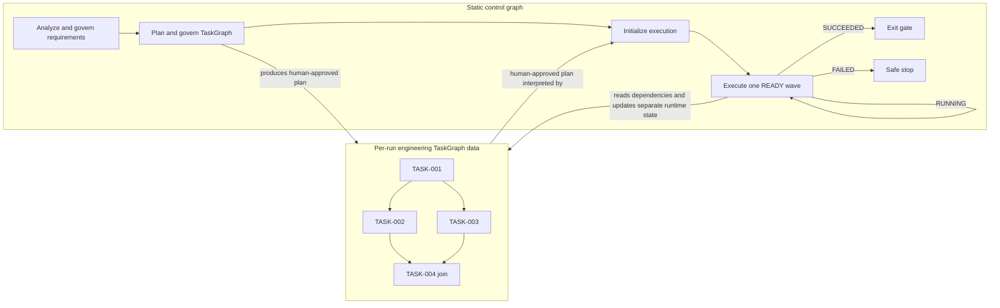
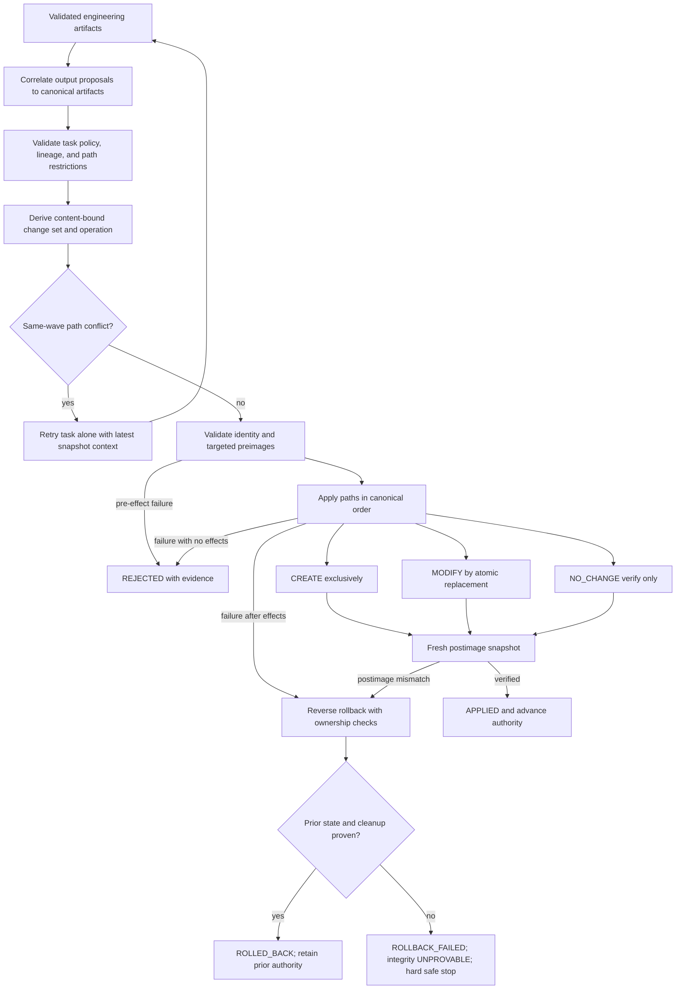

# Agentic SDLC Orchestrator Architecture

## 1. Architecture Purpose

This prototype demonstrates controlled autonomy across an engineering lifecycle. It uses LLMs where interpretation and decomposition are useful, but it does not treat generated text as authority. Deterministic application code validates proposals, humans approve the two consequential planning boundaries, and execution is confined to a run-scoped isolated workspace.

The governing idea is simple: probabilistic components propose engineering intent; deterministic controls decide what is admissible; humans authorize requirements and plans; bounded execution performs only approved work; content-bound evidence records what occurred. Governance, lineage, and failure containment are therefore architectural components, not reporting added after execution.

## 2. Architecture at a Glance

Requirement intake normalizes the submitted requirement text and preserves a separate application-owned project delivery policy. Before any LLM call, the deterministic `entry_gate` requires a non-empty project name and at least one normalized non-empty requirement; failure ends as `entry_gate_failed`. Valid input then moves through structured analysis, deterministic readiness, human review, canonical specification packaging, TaskGraph planning, DAG and delivery-role validation, and a second human review. The approved TaskGraph is interpreted by a deterministic scheduler. Task executors reason against task-scoped requirements, accepted dependency artifacts, structured deliverable roles, and an exact bounded repository view. Only validated desired-file proposals can reach the mutation layer, and only inside the workflow's isolated workspace. Completion requires the final exit gate; safe stops retain evidence without claiming success.

## 3. Two-Graph Orchestration Model

The system has two graphs with different authority and lifetimes.

The **control graph** is the relatively stable LangGraph topology in `src/agentic_sdlc/workflow.py`. It owns lifecycle routing, bounded machine retries and human-requested revisions, interrupts, safe stops, execution-loop iteration, and the workflow exit gate. Its human checkpoints use `interrupt()` with an `InMemorySaver`; resumability is process-local and does not survive a process restart. The LLM neither creates LangGraph nodes nor rewrites routes.

The **engineering TaskGraph** is an immutable, per-run dependency DAG. The planner proposes tasks using temporary keys; application code assigns canonical `TASK-###` identities, validates dependency and requirement references, rejects cycles and missing FR/NFR/CON/AC coverage, and derives topological layers, entry-ready tasks, terminal predecessors, and synchronization points from `depends_on`. A human-approved TaskGraph is data consumed by the fixed execution loop—tasks do not become LangGraph nodes. Each task is explicitly typed as `DESIGN`, `IMPLEMENTATION`, `TEST`, `DOCUMENTATION`, `VALIDATION`, or `RELEASE`, so the DAG represents lifecycle work rather than only code generation. Structured deliverable roles and the application delivery policy are included in canonical graph identity and are visible at the existing human review gate; they grant no additional tool or filesystem authority.

This separation permits dynamic work decomposition without dynamic control-plane mutation. Dependencies and joins are explicit; independent tasks can execute together; downstream work unlocks only after every dependency succeeds. Canonical ordering, source authority, approval history, and runtime snapshots make the interpretation reproducible even when executor calls complete in a different physical order.

## 4. Governance and Authority Model

Generation is not authority. Each component receives only the authority required for its role.

| Component or record | Authority and trust boundary |
|---|---|
| LLM analyst, planner, executor | Proposes structured analysis, task decomposition, semantic outputs, and output-to-path suggestions; cannot approve, settle tasks, assign canonical evidence identity, or mutate files. |
| Human reviewer | May `APPROVE`, `REQUEST_CHANGES`, or `REJECT` validated requirement analysis and TaskGraph candidates; a blocked analysis cannot be approved. |
| Control graph / orchestrator | Enforces routing, budgets, canonical ordering, validation, scheduling, settlement, safe stop, and exit-gate decisions. |
| `ApprovedRequirementSpec` | Canonical downstream requirement authority, deterministically packaged from the exact approved READY analysis revision. |
| `ProjectDeliveryPolicy` | Application-owned governance context, separate from business requirements; `RUNNABLE_PROJECT` requires structured entrypoint, test, and root run-guide responsibilities. |
| Approved `TaskGraph` | Human-authorized work, dependencies, references, outputs, deliverable roles, and per-task materialization policy for one source-spec identity/version and delivery policy. |
| Isolated workspace and session | The only live repository-like filesystem capability; its authoritative snapshot advances only after verified application. |
| Mutation layer | Derives and applies the restricted complete-file vocabulary `CREATE`, `MODIFY`, and `NO_CHANGE`; it does not accept an LLM-declared operation. |
| Live run evidence bundle | Application-owned output under `runs/<run-id>/sdlc-artifacts/`; Task Agents receive no path or mutation authority over it. |
| Authoritative Git repository | Outside autonomous execution authority. The runtime exposes no commit, branch, push, PR, merge, worktree, or promotion operation. |
| Reliability reporter | Reads terminal evidence, validates accounting, and emits a separate deterministic metrics projection; it cannot alter execution. |

TaskGraph approval includes each task's `FORBIDDEN`, `ALLOWED`, or `REQUIRED` materialization policy. That approval grants bounded execution authority only within the isolated workspace. It grants no shell, generated-code execution, deployment, or Git authority.

## 5. Requirement Authority and TaskGraph Authority

Validated requirement analyses are accumulated as ordered revision records containing revision and attempt numbers, prompt/model provenance, reviewer feedback, the exact analysis, and its deterministic planning-readiness decision. `REQUEST_CHANGES` preserves the prior record, passes the human feedback into a new analysis revision, and resets only the bounded machine-attempt budget. The normal workflow creates one version-1 `ApprovedRequirementSpec` after a READY revision is approved; the package records `source_analysis_revision`, canonical item IDs and lineages, a content hash, and the exact approved text without another LLM rewrite.

Planning consumes only that specification. The resulting TaskGraph embeds its source `spec_id` and version; human TaskGraph revisions retain graph lineage and supersession. Execution validates the source-spec pair before workspace initialization and again before every execution-loop advance. A mismatch yields `STALE_TASK_GRAPH` before request construction, workspace access, or mutation.

The planner also receives a separately serialized `ProjectDeliveryPolicy`. The default `ENGINEERING_ARTIFACTS` mode preserves existing workflows. `RUNNABLE_PROJECT` deterministically requires `RUNNABLE_ENTRYPOINT`, `AUTOMATED_TESTS`, and `RUN_INSTRUCTIONS` coverage on REQUIRED-materialization tasks. This policy does not amend the approved requirement specification or authorize resolution of unrelated ambiguity. Executor validation binds those roles to materializable canonical SOURCE, TEST, and root `README.md` DOCUMENTATION artifacts respectively, with correctable defects using the existing bounded retry path.

The authority chain is therefore: approved analysis revision → canonical specification → validated TaskGraph → human TaskGraph approval → execution authority. An upstream authority change invalidates stale downstream planning; regeneration and governance are required before a new plan can gain execution authority. The prototype detects and stops stale execution, but it does not automatically synthesize the replacement graph.

## 6. Execution Runtime and Workspace Isolation

Runtime progress is separate from the immutable approved plan. Tasks start as `READY` when dependency-free and `BLOCKED` otherwise. The scheduler selects at most two ready tasks in canonical TaskGraph order, atomically marks the wave running, joins all authorized executor calls, and settles results deterministically. Dependency chains therefore execute as sequential singleton waves, while independent ready work can share a bounded parallel wave. A dependent becomes ready only when every declared predecessor has succeeded with complete accepted evidence.

Only `TaskExecutor.execute()` calls run in worker threads. Request building, bounded repository reads, canonicalization, validation, conflict analysis, mutation, recovery categorization, and state settlement remain single-threaded. Thus engineering reasoning can overlap while audit order and filesystem mutation remain deterministic. A terminal peer failure freezes new dispatch, while already-running peers are joined and may retain valid evidence without unlocking further work.

Each task can make at most three attempts. Application policy—not the LLM—classifies a constrained set of provider, correlation, semantic-validation, materialization, conflict, and mutation failures as retryable. A retry re-executes the same approved task with application-owned feedback and a new deterministic request/attempt identity. There is no hidden SDK retry, delay/backoff, or fallback model/provider. The only execution fallback is bounded serialization after a same-wave write conflict: conflicting tasks consume retry budget and rerun one at a time against the latest snapshot.

The live filesystem capability is a factory-created unique temporary directory bound by workspace ID plus root device/inode. Snapshots walk regular files without following symlinks. A governed session preserves an immutable baseline snapshot and advances an authoritative snapshot only after verified mutation. Workspaces are disposable in scope but currently retained for inspection rather than automatically deleted.

Brownfield context is deliberately bounded. An application-owned path provider selects explicit baseline, dependency-materialized, and conflict/mutation-retry paths. The executor receives exact UTF-8 contents or proven absence, hashes, and the authoritative snapshot binding—not an arbitrary path, root handle, whole-repository scan, or browsing capability. Scenario seeding copies only an explicit scenario manifest before the governed session begins.

## 7. Governed Mutation Transactions

Engineering artifacts are semantic evidence until a validated materialization proposal correlates an output ordinal to a canonical artifact and repository-relative path. The application validates task policy, artifact set, path uniqueness, lineage, and provenance, then derives a content-bound `WorkspaceChangeSet`. Complete artifact content is the desired file state: `CREATE` means the path was absent, `MODIFY` means an existing hash differs, and `NO_CHANGE` means existing content already matches. `NO_CHANGE` verifies state and performs no write.

Paths must be canonical relative POSIX paths. Absolute, drive-qualified, traversal, aliased, protected `.git`, exact `.env`, virtual-environment, symlinked, special-file, and duplicate targets fail closed; `DELETE` is absent. Validation recomputes change-set identity and checks targeted optimistic preimages against the current real snapshot. This permits disjoint changes derived from one wave snapshot to apply serially even after the global snapshot advances, while stale target state is rejected.

Application is a process-level transaction: `CREATE` uses exclusive creation, `MODIFY` stages a same-directory atomic replacement while preserving mode bits, and a fresh snapshot verifies every postimage. Once effects exist, handled failure triggers reverse rollback. Created files/directories are removed and modified bytes/modes restored only if captured device, inode, content, and mode evidence still proves transaction ownership. Rollback is verified. Inability to prove cleanup or workspace integrity becomes explicit `ROLLBACK_FAILED`, marks the session `UNPROVABLE`, aborts unsettled peers, and hard-stops all further dispatch and mutation. This is not crash-consistent journaling or hostile-process isolation.

## 8. Ambiguity Governance and Governed Replanning

The ambiguity reviewer scenario starts with: “Enhance the URL shortener so shortened URLs automatically expire after a period of time.” Revision 0 identifies unresolved choices including TTL duration and start, expired redirect/analytics behavior, existing-code scope, and persistence. Because `needs_clarification=true`, deterministic readiness is `BLOCKED`; the human interrupt offers only `REQUEST_CHANGES` or `REJECT`, the planner has zero calls, and neither a specification nor TaskGraph exists.

The recorded `REQUEST_CHANGES` decision clarifies a fixed 24-hour TTL from creation, process-local storage, HTTP 404 at and after expiration, no migration, and access-time checking. Revision 1 preserves the decision lineage, becomes `READY`, and is human-approved. Only then is the exact revised analysis packaged as the authoritative specification and supplied to planning; the approved TaskGraph records that revised source identity.

This scenario demonstrates the governed replanning boundary, but Revision 1 produces the first authorized TaskGraph: Revision 0 was blocked before planning and therefore had no plan to replace. Separately, if an approved TaskGraph already exists and its source specification ID/version no longer matches the current requirement authority, source-authority validation blocks runtime initialization or the next execution-loop advance before workspace access, request dispatch, or mutation. The stale graph cannot continue to exercise execution authority; a regenerated plan requires deterministic validation and renewed human governance before it can execute.

These controls do not perform live TaskGraph topology mutation, active dependency surgery, running-task migration, cancellation, or active-DAG rewriting.

## 9. Exit Gate and Durable Project Promotion

Task success alone is insufficient. The workflow exit gate checks processed input, approved validated analysis, an approved specification, validated and approved TaskGraph evidence, `SUCCEEDED` runtime state, exact final-attempt request/result/artifact/validation chains, verified workspace integrity, and complete final materialization/mutation/exit-decision evidence. A `REQUIRED` materialization task must have passed materialization evidence and an `APPLIED` transaction; non-materializing permitted tasks still require a successful governed exit decision. For `RUNNABLE_PROJECT`, a final `ProjectReadinessValidation` additionally proves that every required role is backed by a successful final task attempt, passed semantic and materialization evidence, a validated/applied change set, and a matching path/content hash in the authoritative final snapshot; run instructions must resolve specifically to root `README.md`.

This is an evidence-completeness and workspace-integrity boundary, not runtime execution or deployment authority. Runnable-project readiness proves required launch/test surfaces and reviewer instructions are materially present; `runtime_execution_verified` remains false. After the gate passes, the live CLI resolves the exact retained workspace capability for the run and invokes the unchanged project exporter. The exporter compares the current source to the authoritative snapshot, copies only canonical regular-file entries using descriptor-relative no-follow POSIX operations, verifies the staged snapshot, reserves a new non-overwriting directory under `projects/`, promotes relative to retained staging/destination descriptors, and verifies the durable result against the same snapshot. Export fails closed where those filesystem primitives are unavailable. The durable directory is not an agent workspace. The orchestrator does not run the generated product or its tests, initialize Git, deploy, or invoke CI/CD.

## 10. Traceability and Reliability Evidence

Within a workflow run, frozen Pydantic contracts make canonical plan, execution, artifact, workspace, mutation, and final project-readiness records immutable by contract, while `operator.add` state reducers accumulate histories rather than replace them. Together they retain requirement analyses and human decisions, TaskGraph candidates and approvals, execution waves, requests, results, failures, recovery decisions, canonical engineering artifacts, bounded workspace requests, snapshots, materialization validations, change sets, conflicts, mutation results, task-attempt exit decisions, and role-to-final-snapshot readiness evidence. Deterministic UUIDv5 identifiers and content hashes bind specification, graph, task, attempt, request, artifact slot, content, references, and mutation evidence. Failed attempts remain audit evidence; only the final successful attempt's exactly validated artifact set can feed dependents. The default `InMemorySaver` checkpoint is process-local, and exported JSON/Markdown reviewer artifacts are ordinary files rather than a tamper-evident durable event store.

The repository separates artifact ownership. `artifacts/` contains curated,
checked-in evaluator/reference evidence and remains the source for deterministic
cross-scenario reliability metrics. A live CLI invocation instead derives one
`runs/<run-id>/sdlc-artifacts/` directory from the existing governed run ID and
uses it for initial execution, approval resumes, terminal evidence, and the static
workflow diagram. At successful or safely stopped termination, an
`sdlc-artifact-manifest-v1` manifest binds run/status/policy/exit metadata to sorted
bundle-relative file hashes and byte sizes. It lists only evidence actually
present, excludes itself, and makes no signing or tamper-proofing claim. This
application-owned directory is outside Task Agent workspace and mutation authority.
It is not yet copied into `projects/<project-name>/`; composite packaging is a
separate promotion concern.

`artifacts/reliability_metrics.json` is generated as a deterministic projection over the checked-in terminal `task_execution.json` and `workspace_execution.json` evidence for the three scenarios. The derivation validates that every started attempt has exactly one exit decision, then reports task outcomes, attempt outcomes, success ratios, retry frequency, mutation and rollback counts/frequency, and safe-stop count. It is read-only with respect to execution behavior and is not a telemetry subsystem.

End-to-end latency and MTTR are explicitly `NOT_MEASURED`: the evidence model retains structural events but not authoritative elapsed-time or incident-to-recovery boundaries. Reliability claims are made only where retained evidence supports them; no timing precision is inferred from creation timestamps or file metadata.

## 11. Architectural Decisions and Deliberate Limitations

- **No live TaskGraph mutation.** Static control topology plus governed plan regeneration favors reproducibility over runtime graph surgery.
- **No autonomous Git promotion.** Agent mutation authority ends at the isolated workspace. The application may promote an exit-verified snapshot into a new durable project directory, while branch, commit, push, review, merge, and release decisions remain outside the autonomous loop.
- **Restricted mutation vocabulary.** Complete-file `CREATE`, `MODIFY`, and `NO_CHANGE` make preimages, postimages, conflicts, and rollback defensible; arbitrary filesystem operations and `DELETE` are excluded.
- **Bounded repository reasoning.** Explicit path projections reduce context and prevent autonomous discovery, at the cost of requiring application-owned context selection.
- **Serialized mutation after parallel reasoning.** This preserves deterministic evidence and transaction ordering while still demonstrating real concurrent executor calls.
- **No unsupported timing metrics.** MTTR and end-to-end latency remain unmeasured until authoritative timing boundaries exist.
- **Prototype recovery scope.** The design is not a distributed scheduler, persistent cross-process recovery platform, crash-durable transaction manager, CI/CD system, deployment service, or remote repository manager.

## 12. Reviewer Evidence Anchors

- **Greenfield:** reviewer bundle `artifacts/demo-run/`; runnable export `artifacts/demo-run/generated-project/` (11 tests).
- **Brownfield:** reviewer bundle `artifacts/brownfield-demo-run/`; runnable export `artifacts/brownfield-demo-run/enhanced-project/` (18 tests).
- **Ambiguous requirement:** reviewer bundle `artifacts/ambiguity-demo-run/`; runnable export `artifacts/ambiguity-demo-run/expiration-project/` (20 tests). `artifacts/ambiguity-demo-run/ambiguity_resolution.json` is the concise governance record.
- **Reliability:** `artifacts/reliability_metrics.json` indexes deterministic measures derived from all three run-evidence bundles.
