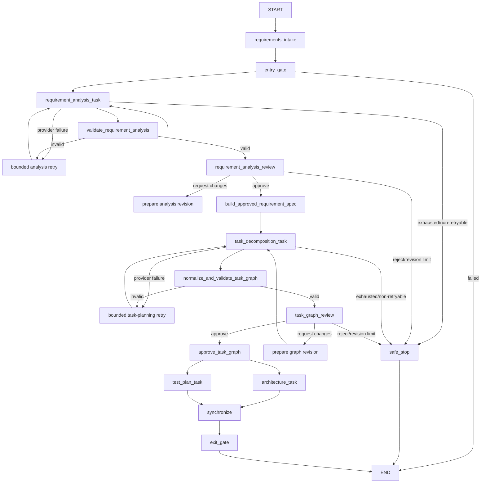

# Agentic SDLC Orchestrator

This repository incrementally demonstrates controlled, auditable execution across
the software-development lifecycle.

## Version progression

- **V0.1 — LangGraph orchestration foundation:** explicit sequential and parallel
  control flow, synchronization, gates, state, trace, and artifacts.
- **V0.2 — Stateful human governance:** checkpointed APPROVE,
  REQUEST_CHANGES, REJECT, bounded revisions, and safe stop.
- **V0.3 — Governed LLM requirement reasoning:** schema-backed requirement
  analysis, deterministic validation, human revision, and decision lineage.
- **V0.4 — Governed LLM task planning:** a human-approved requirement
  specification, LLM-proposed engineering task dependencies, deterministic graph
  normalization/validation, and human TaskGraph approval.

V0.4 plans engineering work but deliberately does **not execute tasks**, write
application code, or implement the URL Shortener demonstration service.

## Two distinct graphs

V0.4 intentionally keeps two graph concepts separate.

### Orchestration / control graph

The static application workflow is implemented with LangGraph. It owns routing,
bounded retries and revisions, human interrupts, safe-stop behavior, checkpointed
state, the existing parallel artifact branches, synchronization, and the exit
gate. The LLM never creates or changes LangGraph nodes or routes.



Both human checkpoints use LangGraph `interrupt()` and a process-local
`InMemorySaver`; the CLI resumes the same thread with `Command(resume=...)`.
Interrupted state survives within the current process, not across process restarts.

### Engineering task dependency graph

The `TaskGraph` is a dynamic per-run domain artifact. The LLM proposes semantic
tasks and dependencies using temporary keys. Application code assigns authoritative
identity, validates references and the DAG, derives graph semantics, and a human
approves the result. A future executor may interpret this graph; V0.4 does not.

Connectivity is represented once through `Task.depends_on`. Topological order,
execution layers, naturally parallel tasks, ENTRY-ready tasks, EXIT predecessors,
and synchronization points are derived rather than stored as competing
authoritative graph copies.

## Governed planning and lineage

After requirement-analysis approval, deterministic code packages the exact
approved text into an immutable `ApprovedRequirementSpec`. There is no second LLM
rewrite between approval and specification creation.

The application assigns these human-readable namespaces:

- `FR-001`, `FR-002`, ... — functional requirements
- `NFR-001`, ... — nonfunctional requirements
- `CON-001`, ... — constraints
- `AC-001`, ... — acceptance criteria
- `RISK-001`, ... — risks
- `AMB-001`, ... — approved unresolved ambiguities

Each item also receives an application-generated durable lineage UUID. The spec
has a version, content hash, creation timestamp, optional predecessor ID, and
source analysis revision. Text is copied exactly from the approved analysis.

The task planner receives only this approved specification. It may propose task
titles, descriptions, types, temporary keys, dependencies, traceability references,
and expected outputs. It cannot assign `TASK-###`, graph IDs, lineage IDs,
timestamps, hashes, versions, layers, ENTRY/EXIT tasks, approval state, or execution
state.

Deterministic normalization maps proposal order to `TASK-001`, `TASK-002`, and so
on, remaps temporary dependency keys, and assigns stable task lineage from the graph
lineage plus semantic key. Validation rejects duplicate keys/IDs, missing or self
dependencies, cycles, invalid specification references, and graphs without valid
synthetic ENTRY/EXIT semantics. Invalid graphs never reach human review.

An approved ambiguity remains explicit. For example, `AMB-001: URL expiration is
unspecified` can support a task to resolve that policy; the planner is instructed
not to silently replace it with a made-up 30-day expiration rule.

TaskGraph review supports APPROVE, REQUEST_CHANGES, and REJECT. Requested changes
preserve feedback and the prior validated graph, receive a fresh three-attempt
machine retry budget, create a new immutable graph version, and return to review.
Human graph revisions are separately limited to three. Rejection or exhaustion
safe-stops without executing tasks.

The models include versions, content hashes, lineage IDs, and optional predecessor
IDs so a future milestone can represent `SPEC-v1 -> GRAPH-v1` followed by
`SPEC-v2 -> GRAPH-v2` without mutating history. V0.4 does not implement upstream
change reconciliation or execution-state migration.

## Setup and run

Python 3.13 or newer is required.

```bash
python3 -m venv .venv
.venv/bin/python -m pip install -e ".[dev]"
cp .env.example .env
```

Set a real `OPENAI_API_KEY` in the ignored local `.env`. `OPENAI_MODEL` defaults
to `gpt-5.6-luna`. The project does not load `.env` itself, so export it before the
interactive demo:

```bash
set -a
source .env
set +a
.venv/bin/python -m agentic_sdlc demo
```

The CLI presents the full requirement analysis first. After requirement approval,
it displays the canonical specification namespaces, TaskGraph tasks and links,
derived execution layers, parallelism, joins, and ENTRY/EXIT semantics. It then
pauses for separate TaskGraph approval. REQUEST_CHANGES feedback at either stage
may span multiple lines and ends with a blank line.

Missing credentials never trigger a fake fallback. A missing key at either LLM
stage records a clear non-retryable failure and safely stops.

Successful artifacts are written under `artifacts/demo-run/`:

```text
requirements.json
requirement_analysis.md
approved_requirement_spec.json
task_graph.json
task_graph.md
architecture.md
test_plan.md
summary.md
```

`task_graph.json` is the canonical graph. `task_graph.md` is a human-readable view
that includes derived layers and governance history. The generated
`artifacts/workflow_diagram.png` documents the static LangGraph control plane, not
the per-run engineering TaskGraph.

## Tests

```bash
.venv/bin/python -m pytest
```

Tests inject scripted `FakeRequirementAnalysisClient` and
`FakeTaskPlanningClient` instances. They require no API key or network access and
cover structured parsing, retries, safe stops, identity assignment, lineage,
reference integrity, DAG validation, derived parallel/join semantics, both human
approval loops, artifacts, and the preserved static parallel branches.

## Deliberately deferred

V0.4 does not include task execution, code-generation or repository-writing
agents, dynamically generated LangGraph nodes, full dynamic replanning, completed
task reconciliation, brownfield impact analysis, rollback, a database/audit store,
distributed scheduling, deployment, or a web UI.
