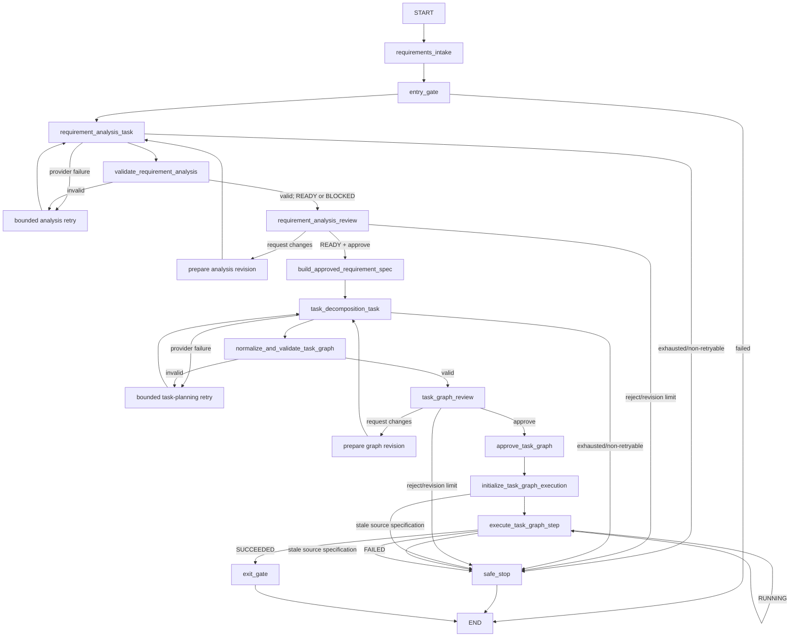

# Agentic SDLC Orchestrator

This repository incrementally demonstrates controlled, auditable execution across
the software-development lifecycle.

## Evaluator guide

For the quickest evaluation path, use these documents and retained evidence:

| Purpose | Start here |
| --- | --- |
| Evaluate and judge: engineering approach, rationale, evidence, decisions, risks, trade-offs, assumptions, limitations, and readiness | [Engineering summary](ENGINEERING_SUMMARY.md) |
| Inspect and verify: detailed architecture, authority model, orchestration, TaskGraph execution, mutation/rollback, and reliability mechanics | [Architecture](ARCHITECTURE.md) |
| Inspect cross-scenario reliability evidence | [`artifacts/reliability_metrics.json`](artifacts/reliability_metrics.json) |

| Scenario | Reviewer bundle | Runnable product | Verified product validation |
| --- | --- | --- | --- |
| Greenfield | [`artifacts/demo-run/`](artifacts/demo-run/) | [`generated-project/`](artifacts/demo-run/generated-project/) | 11 tests passed |
| Brownfield | [`artifacts/brownfield-demo-run/`](artifacts/brownfield-demo-run/) | [`enhanced-project/`](artifacts/brownfield-demo-run/enhanced-project/) | 18 tests passed |
| Ambiguous requirement | [`artifacts/ambiguity-demo-run/`](artifacts/ambiguity-demo-run/) | [`expiration-project/`](artifacts/ambiguity-demo-run/expiration-project/) | 20 tests passed |

The `artifacts/` tree is curated, checked-in evaluator/reference evidence. Normal
live CLI runs do not rewrite it: per-run SDLC evidence is generated under the
ignored `runs/` tree, while successful durable delivery packages remain under the
separate ignored `projects/` tree. Each successful package contains an
application-controlled, verified `sdlc-artifacts/` copy of its retained run
evidence. In Git ownership terms, `artifacts/` is tracked curated evidence,
`projects/` is ignored durable generated output, and `runs/` is ignored live-run
output. `.gitignore` prevents new untracked files from being added implicitly; it
does not retroactively untrack files that are already committed.

The orchestrator materializes runnable application code and tests in an isolated
workspace, but deliberately does not execute generated code as part of its exit
gate or autonomously perform Git promotion, CI/CD promotion, or deployment.

`V0.1` through `V0.9` below are engineering milestone labels for the incremental
assessment implementation; they are distinct from the Python package version in
`pyproject.toml` and do not imply semantic compatibility with it.

## Version progression

- **V0.1 — LangGraph orchestration foundation:** explicit sequential and parallel
  control flow, synchronization, gates, state, trace, and artifacts.
- **V0.2 — Stateful human governance:** checkpointed APPROVE,
  REQUEST_CHANGES, REJECT, bounded revisions, and safe stop.
- **V0.3 — Governed LLM requirement reasoning:** schema-backed requirement
  analysis, deterministic validation, human revision, and decision lineage.
- **V0.4 — Governed LLM task planning:** a human-approved requirement
  specification, LLM-proposed engineering task dependencies, deterministic graph
  normalization/validation, and human TaskGraph approval.
- **V0.5 — Governed TaskGraph execution runtime:** separate
  execution state, deterministic readiness and transitions, application-owned
  contracts and artifacts, a bounded OpenAI executor, and a static governed loop
  that interprets the approved engineering TaskGraph through bounded parallel
  execution waves and governed mutation of one disposable isolated workspace.
- **V0.6 — Governed ambiguity resolution:** deterministic
  requirement planning readiness, clarification through the existing immutable
  analysis-revision loop, stale TaskGraph/source-spec execution protection, and a
  reproducible third reviewer scenario that resolves an intentionally ambiguous
  URL-expiration requirement before planning and governed brownfield execution.
- **V0.7 — Durable project export:** promotion of an exit-verified isolated
  workspace snapshot into a new non-overwriting `projects/<project-name>/`
  directory, with staging/final verification and descriptor-relative no-follow
  filesystem containment.
- **V0.8 — Runnable project readiness:** an application-owned delivery policy,
  structured `RUNNABLE_ENTRYPOINT`, `AUTOMATED_TESTS`, and `RUN_INSTRUCTIONS`
  task roles, deterministic artifact/materialization/readiness evidence, and
  exit-gate enforcement for runnable-project workflows.
- **V0.9 — SDLC artifact ownership and composite publication:** isolated
  per-run evidence under `runs/<run-id>/sdlc-artifacts/`, a deterministic
  manifest, a reserved application-owned project namespace, and projection-based
  publication of verified project content plus verified SDLC evidence.
- **V0.10 — live Task Agent execution progress:** application-owned wave,
  attempt, heartbeat, executor-completion, and settled-outcome output during the
  blocking post-approval execution interval, without changing workflow evidence.

The V0.5 execution slices execute approved engineering tasks as bounded semantic
LLM calls and may transactionally materialize validated executable URL-shortener
application code and tests only beneath one factory-created disposable workspace.
They do **not** mutate the orchestrator checkout or an authoritative repository,
run generated code or commands, perform Git operations, use fallback models,
promote through CI/CD, or deploy.

## Two distinct graphs

The governed design keeps two graph concepts separate.

### Orchestration / control graph

The static application workflow is implemented with LangGraph. It owns routing,
bounded planning retries and revisions, human interrupts, safe-stop behavior,
checkpointed state, execution-loop iteration, and the exit gate. The LLM never
creates or changes LangGraph nodes or routes.



Both human checkpoints use LangGraph `interrupt()` and a process-local
`InMemorySaver`; the CLI resumes the same thread with `Command(resume=...)`.
Interrupted state survives within the current process, not across process restarts.

### Engineering task dependency graph

The `TaskGraph` is a dynamic per-run domain artifact. The LLM proposes semantic
tasks and dependencies using temporary keys. Application code assigns authoritative
identity, validates references and the DAG, derives graph semantics, and a human
approves the result. V0.5 interprets it as dynamic data through a fixed LangGraph
execution loop; TASK-### records do not become LangGraph nodes.

Connectivity is represented once through `Task.depends_on`. Topological order,
execution layers, naturally parallel tasks, ENTRY-ready tasks, EXIT predecessors,
and synchronization points are derived rather than stored as competing
authoritative graph copies.

### Deterministic execution runtime foundation

The execution runtime keeps mutable progress separate from the immutable approved
plan:

```text
approved TaskGraph
    -> TaskGraphExecutionState
    -> deterministic readiness and synchronization transitions
```

After final TaskGraph approval, the live CLI immediately states that governed Task
Agent execution has begun; no additional Return or blank-line input is required
unless a later explicit governance interrupt is displayed. It reports canonical
wave membership, executor completion, and settled outcomes, with a bounded
heartbeat while executor futures remain incomplete. Heartbeats are ephemeral
runtime observability, not percentage-complete claims: they are not added to
`WorkflowState.trace`, checkpoints, run artifacts, manifests, or reliability
metrics. The existing deterministic trace remains the canonical workflow summary.

Tasks without dependencies initialize as `READY`; dependent tasks initialize as
`BLOCKED`. Starting a ready task moves it to `RUNNING` and increments its attempt
count. Successful completion unlocks a blocked task only after every declared
dependency has succeeded. A task failure marks the graph execution `FAILED` and
freezes new dispatch. Already-running peers may settle without unlocking more
work; failure remains sticky, and `SAFE_STOPPED` requires no task to remain
`RUNNING`. Slice 5 adds a controlled `RUNNING -> READY` recovery transition;
`start_task()` remains the only operation that starts and counts a new attempt.

Before runtime initialization and before every execution-loop advance, the
approved TaskGraph's existing `requirement_spec_id` and
`requirement_spec_version` must match the currently authoritative approved
requirement specification. A mismatch produces `STALE_TASK_GRAPH`, creates or
dispatches no task work, and reaches governed safe stop before workspace access
or mutation. Replanning continues through the existing planning lifecycle; V0.6
does not mutate a live DAG, migrate execution state, or automatically construct a
replacement graph.

Multiple tasks can be ready at once. The scheduler selects at most
`MAX_PARALLEL_TASK_EXECUTIONS = 2` in canonical TaskGraph order, starts the whole
authorized wave through the existing governed transition, and joins that wave
before the next scheduler decision.

### Execution contract and artifact boundary

The deterministic contract layer itself stops before scheduler settlement:

```text
TaskExecutionRequest
    -> TaskExecutor
    -> TaskExecutionResult
    -> EngineeringArtifact(s)
    -> TaskExecutionValidationResult
    -> judgment returned to the control plane
```

`TaskExecutionRequest` is application-owned context for one already-running task
attempt. UUIDv5 request and attempt identities are derived from the approved spec,
graph, task, and attempt number. Every request contains the approved normalized
problem statement, requirement type, and assumptions, plus only the canonical
FR/NFR/CON/AC/RISK/AMB items referenced by that task. It does not contain the raw
conversation or requirement-analysis history. Dependency artifacts must be
canonical outputs from the current successful attempt of a declared direct
dependency; arbitrary or transitive artifacts are rejected.

`TaskExecutionResult` is a non-authoritative semantic proposal. It may contain a
summary, typed logical outputs, assumptions, and risks, but it cannot declare task
success or assign canonical IDs, lineage, hashes, or runtime state. Application
code converts each output into an immutable `EngineeringArtifact`, preserving
content while assigning provenance, an attempt-specific artifact ID, and a stable
artifact-slot lineage based on task lineage, output ordinal, type, and logical
name. Semantic cross-attempt reconciliation after output reordering or renaming is
deferred.

An artifact content hash covers canonical output content and authoritative
spec/graph/task/request/attempt/reference provenance, including output ordinal. It
excludes the application-supplied creation timestamp and the derived artifact and
lineage IDs. Artifact production does not equal acceptance: deterministic
`TaskExecutionValidationResult` records the separate judgment and the exact ordered
artifact IDs it evaluated, and no `accepted` flag is stored on the artifact. A
source task's `SUCCEEDED` runtime state is necessary but not sufficient for its
artifacts to become downstream context. The request builder also requires matching
successful validation evidence for each dependency's complete canonical artifact
set; missing, failed, partial, extra, stale, or mismatched evidence is rejected.
Every declared direct dependency requires evidence, including an explicitly
validated empty artifact-ID set when it produced no artifacts; omitting both its
artifacts and validation is not evidence of an empty accepted output. Fan-in
context is ordered by declared dependency and then canonical output order.

Initial validation checks correlation, required output presence, nonblank logical
names and contents, canonical artifact count, provenance, identity/hash integrity,
and output correspondence. V0.4 `expected_outputs` values are free-form descriptive
obligations, so this slice requires at least one output when obligations exist but
does not claim semantic one-to-one matching. Every engineering artifact remains
semantic data unless a separate validated materialization intent proposes it as
desired repository state; artifact type and logical name confer no filesystem
authority.

### Target-workspace desired-state contracts

The orchestrator control plane is conceptually separate from the target engineering
repository and any future disposable run workspace. Immutable, in-memory
`WorkspaceSnapshot` records bind proposals to an explicit `workspace_id`, base
snapshot identity, and canonically ordered repository-relative file hashes. A
snapshot may describe an empty greenfield repository or an existing brownfield
repository; constructing one performs no filesystem reads.

A validated `ArtifactMaterializationIntent` maps one canonical artifact to one
repository-relative POSIX path and treats that artifact's content as the complete
desired file contents. Artifact semantic type is orthogonal to materialization, and
`logical_name` remains descriptive metadata rather than a destination. Trusted
application code validates the intent and derives `CREATE`, `MODIFY`, or
`NO_CHANGE` by comparing the desired-content SHA-256 with the bound snapshot. The
executor cannot choose an operation, preimage, workspace identity, or change-set
identity. An immutable `WorkspaceChangeSet` preserves task-attempt, materialization
validation, and artifact provenance, while `WorkspaceChangeSetValidationResult`
checks lineage, intent correspondence, hashes, operation derivation, ordering, and
optimistic preimages. `TaskExecutionValidationResult` retains its distinct
executor/artifact-validation responsibility.

The initial path policy rejects absolute and drive-qualified paths, backslashes,
NULs, empty/dot/traversal segments, duplicate destinations, `.git`, exact `.env`,
`.venv`, and `venv`; `.env.example` remains legal. Logical validation cannot prove
runtime symlink containment. The isolated runtime below enforces that separate
containment check against the real workspace immediately before mutation.

Parallel change sets begin as isolated desired-state records. Same-path proposals are
sorted and reported deterministically: two `NO_CHANGE` observations are compatible,
while any overlap containing `CREATE` or `MODIFY` fails closed, even for identical
desired contents or mutation plus `NO_CHANGE`. No AI merge or completion-order
selection occurs. After a parallel join, the governed scheduler uses this analysis
before invoking the separate bounded runtime below. DELETE, copying, Git operations,
shell execution, and generated-code execution remain absent.

### Isolated transactional workspace mutation

`workspace_contracts.py` remains the pure, I/O-free desired-state layer. The first
real filesystem authority is the separately bounded `IsolatedWorkspace`
capability: application code creates a unique empty directory, binds its canonical
root and filesystem identity to a non-empty workspace ID, and passes that capability
rather than an arbitrary path. The runtime never implicitly targets the
orchestrator checkout, copies a source repository, or creates a Git worktree.

The runtime snapshots regular files beneath the isolated root without following
symlinks and builds the existing canonical `WorkspaceSnapshot`; binary files use
raw-byte SHA-256 while ordinary UTF-8 files match the existing complete-content
hash. Symlinks, special files, replaced roots, non-directory parents, protected or
noncanonical paths, and physical name aliases are rejected. Immediately before
effects, every target is re-inspected against the real filesystem. This runtime
containment layer supplements rather than replaces the pure lexical path policy.

Mutation requires a passed, issue-free `WorkspaceChangeSetValidationResult` that
correlates exactly with the change set, its base snapshot, and the isolated
workspace. Before any snapshot or effect, the mutator also recomputes the current
canonical change-set identity so stale validation cannot authorize copied or
tampered desired-state contents. The current real snapshot is then checked through
targeted optimistic preimages. Global snapshot drift alone is not a rejection:
disjoint change sets derived from the same base may be applied serially when each
target's own expected preimage still matches.

After whole-change-set preflight, changes are applied in canonical path order.
`CREATE` uses exclusive creation beneath safely created and transaction-tracked
parents; `MODIFY` rechecks its preimage, preserves prior mode bits, and uses a
same-directory temporary file plus atomic replacement; `NO_CHANGE` performs no
write and only verifies state. Materialized artifact content remains complete
desired file data, and neither the LLM nor `TaskExecutor` can claim an operation
occurred or assign a mutation outcome.

Internal MODIFY staging files are transaction-owned effects. A failed staging
operation is a clean rejection only after staging-file removal and absence are
verified. If initial cleanup fails, the normal rollback path retries removal using
captured identity, content, and mode evidence; verified removal yields
`ROLLED_BACK`, while residue that cannot be safely removed or verified yields
`ROLLBACK_FAILED`. Random staging paths remain private runtime details.

A transaction-owned effect is never represented as `REJECTED` merely because an
operational cleanup or inspection failed before its evidence record was finalized.
Descriptor-close failures remain bounded runtime or mutation evidence without
replacing an earlier primary failure. A parent directory is recorded as a possible
effect immediately after successful creation; unavailable ownership metadata then
fails closed as `ROLLBACK_FAILED` rather than forgetting filesystem residue.

Every desired postimage is verified from a fresh real snapshot. A handled failure
after effects begin triggers reverse-order rollback: transaction-created files are
removed only while their recorded device/inode and captured transaction-owned
content hash and mode still match (including safely captured partial CREATE state),
modified files are restored only while the transaction-written identity, content,
and mode remain intact, and transaction-created directories are removed
deepest-first only when they are still the same empty directories. Exact prior bytes
and mode bits are verified after restore.
Intervening content or mode changes are preserved and produce fail-closed
`ROLLBACK_FAILED` evidence rather than being overwritten or deleted.
The immutable result is `APPLIED`, pre-effect `REJECTED`, verified `ROLLED_BACK`, or
explicit `ROLLBACK_FAILED`, with canonical per-file and structured issue evidence.

These guarantees are process-level transactions for handled failures, not
crash-consistent journaling, power-loss durability, ACID filesystem isolation, or
hostile same-host process containment. Workspaces are retained for inspection; no
automatic cleanup, concurrent filesystem mutation, Git/shell operation,
generated-code execution, or promotion into an authoritative repository exists.

### Governed task-to-workspace execution

Every proposed and canonical task carries an explicit human-approved
`materialization_policy`: `FORBIDDEN`, `ALLOWED`, or `REQUIRED`. The planner proposes
that boundary from task semantics rather than task type. REQUIRED means at least one
valid desired repository-file postcondition is eventually necessary; a verified
`NO_CHANGE` may satisfy it. The existing TaskGraph approval gate remains the source
of human authority for this policy.

Application code can establish an immutable `GovernedWorkspaceSession` from a
factory-created `IsolatedWorkspace`. Its baseline and authoritative snapshot IDs
initially identify the same real snapshot and integrity begins `VERIFIED`; this
baseline never changes, while verified `APPLIED` mutations advance only the
authoritative snapshot. A read-only provider accepts only explicit
repository-relative paths and produces a bounded canonical
`RepositoryContext` containing exact UTF-8 file contents and hashes or explicit
nonexistence. It rejects binary requested content, identity mismatch, symlinks,
unverified integrity, and live drift before binding evidence to the authoritative
snapshot.

Every executor attempt now receives a strict `WorkspaceBoundTaskExecutionRequest`
that combines the unchanged canonical task request with one matching
`WorkspaceBinding` and bounded `RepositoryContext`. The live
`IsolatedWorkspace` capability remains in a per-compiled-workflow runtime owner,
outside serialized/checkpointed state and outside executor input. Default greenfield
runs receive one empty workspace; application code may instead bind one already
factory-created isolated workspace before the run without copying or selecting a
source checkout.

The executor may return non-authoritative `ArtifactMaterializationProposal` values
that identify a semantic output by 1-based output index and propose a target path.
Only application code can correlate that output to its canonical artifact ID and
create a strict `ArtifactMaterializationIntent`. Separate immutable validation then
proves task policy, canonical artifact correlation, unique artifact/path intent
mapping, and lineage before generic change-set derivation. Neither proposals nor
intents confer filesystem capability or select `CREATE`, `MODIFY`, or `NO_CHANGE`.

At each scheduler wave boundary, the control plane verifies the live workspace
against the session's authoritative snapshot and binds every parallel attempt to
that same exact snapshot. Explicit baseline paths, successfully materialized direct
dependency paths, and immediately prior conflict/stale-mutation targets form the
only bounded repository-context selection inputs; no autonomous browsing or
whole-repository scan exists. Worker threads perform only executor reasoning. After
the full join, the control plane canonicalizes and validates all evidence in
TaskGraph order, reconciles write/write conflicts, then applies non-conflicting
per-task transactions serially in canonical order.

Disjoint same-base change sets remain applicable through targeted optimistic
preimages even after an earlier task advances the global snapshot. Same-path
mutation conflicts do not select a completion-order winner: eligible participants
consume the existing retry budget and fall back to explicit singleton waves in
canonical task order, each bound to the latest authoritative snapshot. This is
bounded execution fallback, not TaskGraph replanning. Read/write stale-context
conflict detection remains deferred.

`APPLIED` requires a verified postimage and advances authoritative state;
`REJECTED` and verified `ROLLED_BACK` retain the previously proven snapshot and are
retried only for finite machine-readable causes. `ROLLBACK_FAILED`, pre-dispatch
drift, or another loss of workspace proof marks integrity `UNPROVABLE`, aborts
unsettled peers, freezes all further dispatch/mutation, and produces a hard
safe-stop decision. Ordinary task failure remains distinct and does not make a
trusted workspace unprovable. A task unlocks dependents only after its complete
semantic, materialization, mutation, and governed exit gate succeeds.

### Bounded LLM task-executor adapter

The first provider adapter preserves the contract boundary:

```text
WorkspaceBoundTaskExecutionRequest
    -> OpenAITaskExecutor
    -> TaskExecutionResult
```

`OpenAITaskExecutor` makes one structured-output request using the existing
`OPENAI_MODEL` configuration. Its fixed instructions and deterministic input are
derived only from the authoritative request: approved global and task-scoped
requirement context, the canonical current task, accepted direct-dependency
artifacts, exact workspace binding, bounded repository observations, and correlation
IDs. Raw conversation history, unrelated requirements, unrelated tasks, arbitrary
workflow state, absolute workspace paths, handles, and mutation functions are
excluded. Repository context is authoritative evidence for reasoning, not mutation
authority.

All governed OpenAI Responses calls explicitly set `store=False`, requesting that
generated Responses objects not be stored for later retrieval through the Responses
API. This does not disable the orchestrator's own canonical artifacts or audit
state, and it makes no broader claim about provider-side data handling.

All default governed OpenAI clients for requirement analysis, task planning, and
task execution explicitly use `max_retries=0`. Each application attempt therefore
maps to one SDK/provider invocation, keeping every retry decision explicit at the
orchestrator layer instead of hidden inside the SDK. Injected caller-owned clients
are used as supplied.

Approved FR/NFR/CON/AC items are authoritative engineering obligations, including
constraints or acceptance criteria written in imperative form. Approved assumptions
are authoritative premises; risks are authoritative engineering considerations;
and ambiguities are authoritative unresolved context. An approved ambiguity is
preserved unless the governed task or other approved context explicitly resolves
it. Accepted dependency artifacts remain authoritative engineering input from
predecessor tasks.

All bounded context remains unchanged. Embedded meta-instructions cannot redefine
the executor's role, capabilities, application policy, governance authority, output
contract, or permission for external actions: fixed system instructions define
executor-control authority, while the canonical task defines work scope.

The returned `TaskExecutionResult` remains a non-authoritative semantic proposal,
including any output-index-to-target materialization proposals.
The executor cannot declare success or assign canonical artifact identity,
lineage, hashes, provenance, or runtime state. Application code still performs
artifact canonicalization and deterministic validation separately. The adapter
does not retry internally, write files, run commands, or settle task or graph
state. One `TaskExecutor.execute()` invocation remains exactly one provider attempt.
The static LangGraph loop invokes the adapter and, outside worker threads, owns
proposal correlation, reconciliation, serial mutation, and deterministic
settlement.

### Governed bounded-parallel TaskGraph execution loop

Human TaskGraph approval, including each task's materialization policy, grants
bounded autonomous mutation authority only inside the disposable isolated
workspace. The executor itself still has no filesystem, shell, Git, deployment, or
external-system side effects. Approval enters this fixed lifecycle:

```text
approved TaskGraph
    -> initialize immutable runtime state
    -> select a bounded READY wave in canonical order
    -> start every authorized wave member
    -> verify and freeze one authoritative wave-start snapshot
    -> build bounded workspace requests sequentially
    -> invoke TaskExecutor concurrently for prepared requests
    -> join every authorized peer
    -> canonicalize, validate, and prepare change sets in canonical order
    -> reconcile same-wave write/write conflicts
    -> apply eligible per-task transactions serially
    -> verify/advance workspace authority or hard safe stop
    -> settle deterministically
    -> next wave / success / quiescent safe stop
```

LangGraph topology remains static while the approved engineering graph remains
dynamic per-run data; no `TASK-###` record becomes a LangGraph node. Only
`TaskExecutor.execute()` calls run concurrently in a bounded standard-library
thread pool. Request/context construction, state mutation, canonicalization,
validation, reconciliation, mutation, recovery classification, and scheduler
settlement remain single-threaded. The control plane persists bindings, requests,
results, artifacts, intents, validations, change sets, conflicts, mutation results,
snapshot progression, and exit decisions in canonical wave order, so physical
completion timing cannot change audit or mutation order.

The control plane selects complete successful validation and artifact evidence for
each direct dependency, and the request builder independently revalidates that
evidence. Downstream work remains blocked until the parent's full governed exit
decision succeeds. A terminal peer failure freezes new dispatch but does not cancel
or erase already-authorized executor reasoning; those calls join before settlement.
Workspace-integrity loss additionally prevents remaining mutations and marks
unsettled peers aborted. There is no fallback model, task cancellation, production
timeout, delayed backoff, or work-conserving mid-wave dispatch.

`TaskExecutor` implementations used by parallel dispatch may receive concurrent
`execute()` calls for independent attempts. Custom implementations and injected
clients are responsible for their own concurrency safety. The default
`OpenAITaskExecutor` creates a separate default OpenAI client per invocation when
no client is injected; SDK retries remain disabled and each task attempt still
maps to exactly one governed provider invocation.

### Bounded task-attempt recovery

One task is not necessarily one attempt: one `TaskExecutor.execute()` call is
exactly one attempt, and a task may receive at most three attempts (the original
attempt plus up to two retries). The application—not the LLM—classifies the failure
and chooses `RETRY` or `FAIL_TASK`. Request-build and application-invariant failures
are non-retryable; typed transient provider errors, result-correlation defects, and
an explicit allowlist of correctable validation checks may retry. Unknown failure
types default to non-retryable.

Every retry starts through the same deterministic scheduler order with a new
attempt ID and request ID. The new request carries only application-owned context
explaining why the immediately prior attempt did not complete successfully. When
that feedback identifies a correctable semantic-output defect, the next attempt
corrects it while executing the same approved task. When an executor failure
produced no usable output, the next attempt re-executes that task without inferring
new engineering requirements, constraints, or decisions. Retry context does not
include rejected result or artifact content and cannot change task scope,
requirements, dependencies, ambiguity authority, or executor capabilities. No
fallback provider, sleep, backoff, timer, or internal executor retry exists.

Failed requests, semantic results, canonical artifacts, validations, provider
failure records, and recovery decisions remain append-only audit evidence. Failed
artifacts never gain an `accepted` flag and never enter downstream context. If a
task eventually succeeds, only its final successful attempt and exact passed
validation artifact set may feed dependents. Exhausting attempt three records a
terminal decision, marks the task and graph failed, and uses the existing safe-stop
transition. Parallel readiness is still understood while actual dispatch remains
bounded by deterministic execution waves. A retry becomes a later wave attempt in
the same canonical scheduler order.

The prior V0.4 `architecture_task`, `test_plan_task`, and `synchronize` demo
branches and their obsolete state were removed: they generated canned examples and
would compete with the approved TaskGraph once real semantic task execution begins.
Architecture, source, test, and documentation proposals now originate only from
approved TASK-### execution. They remain canonical evidence unless a separate
validated intent passes the governed isolated-workspace mutation gate.

## Governed planning and lineage

Every validated requirement-analysis revision receives an immutable deterministic
planning-readiness decision. `needs_clarification=true` requires at least one
nonblank ambiguity item and yields `BLOCKED` with reason code
`UNRESOLVED_REQUIREMENT_AMBIGUITY`; `needs_clarification=false` yields `READY`.
An `AMB-###` item does not mechanically block planning, so a knowingly accepted or
non-blocking ambiguity may remain explicit on a ready analysis.

Blocked requirement review exposes only `REQUEST_CHANGES` and `REJECT`, and the
domain path rejects an attempted `APPROVE`. `REQUEST_CHANGES` uses the existing
bounded revision loop: the prior analysis, its ambiguity and readiness evidence,
the human decision, and exact feedback remain in history while the analyst creates
the next revision. No approved requirement specification or TaskGraph-planner call
is permitted until the current revision is ready. Human approval then packages only
that ready revision as the authoritative `ApprovedRequirementSpec` consumed by the
planner.

After requirement-analysis approval, deterministic code packages the exact
approved text into an immutable `ApprovedRequirementSpec`. There is no second LLM
rewrite between approval and specification creation.

The application assigns these human-readable namespaces:

- `FR-001`, `FR-002`, ... — functional requirements
- `NFR-001`, ... — nonfunctional requirements
- `CON-001`, ... — constraints
- `AC-001`, ... — acceptance criteria
- `RISK-001`, ... — risks
- `AMB-001`, ... — approved unresolved ambiguities

Each item also receives a deterministic application-generated lineage UUID. Its
initial identity includes the namespace, canonical item ID, and exact text, so two
same-namespace items with duplicate text still have distinct lineage IDs. Future
cross-version semantic reconciliation is deliberately deferred. Text is copied
exactly from the approved analysis.

The spec has a version, content hash, creation timestamp, optional predecessor ID,
and source analysis revision. A content hash covers the canonical hashed payload,
including its source provenance and application-assigned identities; it excludes
version-envelope fields such as timestamp, version, and predecessor. `SPEC-...-V001`
or `GRAPH-...-V002` identifies a specific immutable artifact version, while its
lineage UUID connects deliberately related versions.

The task planner receives only this approved specification. It may propose task
titles, descriptions, types, temporary keys, dependencies, traceability references,
expected outputs, and an explicit semantic materialization policy. It cannot assign
`TASK-###`, graph IDs, lineage IDs,
timestamps, hashes, versions, layers, ENTRY/EXIT tasks, approval state, or execution
state.

Deterministic normalization maps proposal order to `TASK-001`, `TASK-002`, and so
on, remaps temporary dependency keys, and assigns stable task lineage from the graph
lineage plus semantic key. Validation rejects duplicate keys/IDs, missing or self
dependencies, cycles, invalid specification references, and graphs without valid
synthetic ENTRY/EXIT semantics. Invalid graphs never reach human review.

Core traceability is bidirectional: every task reference must resolve to the
approved specification, and every approved FR, NFR, CON, and AC item must be
covered by at least one task. Missing coverage enters the bounded task-planning
retry path and cannot be human-approved as structurally complete. RISK and AMB
references are validated when present, but complete risk/ambiguity disposition is
intentionally deferred until a later milestone has an explicit disposition model.

An approved ambiguity remains explicit. For example, `AMB-001: URL expiration is
unspecified` can support a task to resolve that policy; the planner is instructed
not to silently replace it with a made-up 30-day expiration rule.

TaskGraph review supports APPROVE, REQUEST_CHANGES, and REJECT. Requested changes
preserve feedback and the prior validated graph, receive a fresh three-attempt
machine retry budget, create a new immutable graph version, and return to review.
Human graph revisions are separately limited to three. Rejection or exhaustion
safe-stops without executing tasks.

The models include versions, content hashes, lineage IDs, and optional predecessor
IDs so `SPEC-v1 -> GRAPH-v1` can be followed by `SPEC-v2 -> GRAPH-v2` without
mutating history. V0.6 prohibits execution of `GRAPH-v1` under `SPEC-v2` authority
and requires governed replanning; it does not implement live upstream-change
reconciliation, DAG mutation, or execution-state migration.

## Reviewer path: three scenarios

Start with each scenario's `summary.md`. Human decisions are in
`requirement_analysis.md` and `task_graph.md`, dependencies are in `task_graph.*`,
and validation/mutation evidence is in `task_execution.json` and
`workspace_execution.json`.

| Scenario | Demonstrates | Reviewer evidence | Runnable product |
| --- | --- | --- | --- |
| Greenfield | Governed planning and transactional creation of a URL shortener | [`artifacts/demo-run/`](artifacts/demo-run/), especially [`summary.md`](artifacts/demo-run/summary.md) and [`task_graph.md`](artifacts/demo-run/task_graph.md) | [`generated-project/`](artifacts/demo-run/generated-project/) |
| Brownfield | Bounded repository reasoning and a governed analytics enhancement | [`artifacts/brownfield-demo-run/`](artifacts/brownfield-demo-run/), especially [`summary.md`](artifacts/brownfield-demo-run/summary.md) and [`workspace_seed.json`](artifacts/brownfield-demo-run/workspace_seed.json) | [`enhanced-project/`](artifacts/brownfield-demo-run/enhanced-project/) |
| Ambiguous | Planning blocked pending human clarification, revised authority, then governed expiration work | [`artifacts/ambiguity-demo-run/`](artifacts/ambiguity-demo-run/), especially [`summary.md`](artifacts/ambiguity-demo-run/summary.md) and [`ambiguity_resolution.json`](artifacts/ambiguity-demo-run/ambiguity_resolution.json) | [`expiration-project/`](artifacts/ambiguity-demo-run/expiration-project/) |

Deterministic per-run reliability metrics for these scenarios are indexed in
[`artifacts/reliability_metrics.json`](artifacts/reliability_metrics.json). They
summarize existing immutable execution and mutation evidence. MTTR and end-to-end
latency are explicitly `NOT_MEASURED` because the deterministic evidence does not
preserve authoritative elapsed-time boundaries.

The checked-in greenfield and brownfield bundles are frozen V0.5 reviewer snapshots;
their Markdown preserves the schema and policy state at generation time. In
particular, the greenfield snapshot's historical `needs_clarification=true` predates
the V0.6 planning-readiness gate and must not be read as current approval behavior.
The ambiguity bundle is the authoritative reviewer proof of the V0.6 `BLOCKED` ->
`REQUEST_CHANGES` -> `READY` -> `APPROVE` lifecycle.

These deterministic checks use scripted clients and require no API key or network:

```bash
# Greenfield workflow/artifact check
.venv/bin/pytest -q tests/test_workflow.py::test_successful_run_writes_canonical_artifact_set

# Brownfield workflow, export, and byte-identical regeneration checks
.venv/bin/pytest -q tests/test_brownfield_demo.py

# Ambiguity checked-in regeneration and complete scenario checks
.venv/bin/python -m tests.demo_ambiguity_scenario artifacts/ambiguity-demo-run
.venv/bin/pytest -q tests/test_ambiguity_demo.py
```

Each product export has its own dependency-free run/test commands in its README.
The real OpenAI-backed interactive path is separate and described below. Successful
reviewer bundles show the positive governed path; bounded retry and safe-stop
evidence is in [`tests/test_workflow.py`](tests/test_workflow.py) and
[`tests/test_task_execution_workflow.py`](tests/test_task_execution_workflow.py),
while fault-injected rollback evidence is in
[`tests/test_workspace_mutation.py`](tests/test_workspace_mutation.py).

## Setup and run

Python 3.13 or newer is required.

```bash
python3 -m venv .venv
.venv/bin/python -m pip install -e ".[dev]"
cp .env.example .env
```

Set a real `OPENAI_API_KEY` in the ignored local `.env`. `OPENAI_MODEL` defaults
to `gpt-5.6-luna`. The project does not load `.env` itself, so export it before the
interactive demo:

```bash
set -a
source .env
set +a
.venv/bin/python -m agentic_sdlc demo
```

An optional project name selects the durable destination folder:

```bash
.venv/bin/python -m agentic_sdlc demo --project-name my-url-shortener
```

The CLI presents the full requirement analysis first. After requirement approval,
it displays the canonical specification namespaces, TaskGraph tasks and links,
application-owned project delivery policy, structured delivery roles, derived
execution layers, parallelism, joins, and ENTRY/EXIT semantics. It then pauses for
separate TaskGraph approval. REQUEST_CHANGES feedback at either stage may span
multiple lines and ends with a blank line.

The built-in URL-shortener demo explicitly selects `RUNNABLE_PROJECT`; this
governance context is separate from the human-approved business requirement. Its
TaskGraph must assign REQUIRED materialization responsibility for a genuine
launch/use surface, automated tests, and a root `README.md` containing exact
setup, run, test, usage, and material prototype-limitation guidance. Structured
role coverage is validated before human TaskGraph review rather than inferred from
task titles or filenames.

Missing credentials never trigger a fake fallback. A missing task-executor key is
classified non-retryable, records a clear failure, and safely stops.

For `RUNNABLE_PROJECT`, the exit gate additionally requires final project-readiness
evidence linking the approved roles to successful final attempts, canonical typed
artifacts, passed materialization/change-set evidence, applied workspace mutations,
and matching paths/content hashes in the authoritative final snapshot. Only after
that gate passes does the CLI publish a composite package into
`projects/<project-name>/`. The isolated temporary workspace remains the sole task
execution environment. The exporter revalidates that live capability and the
same-run successful SDLC bundle, then builds the application files and reserved
`sdlc-artifacts/` projection together in staging. Descriptor-relative, no-follow
POSIX operations protect both copies and promotion. Staging and final verification
require the application projection to equal the authoritative workspace, the
evidence projection to equal the validated manifest bundle, and no third set of
paths. The exporter fails closed when required primitives are unavailable and
never overwrites an explicit destination.
Failed, rejected, or safe-stopped runs do not create a durable project;
automatically selected name collisions receive a deterministic run-derived suffix.

Each live CLI invocation uses its existing governed run ID to own one evidence
bundle. A successful run is written under:

```text
runs/
└── demo-<uuid>/
    └── sdlc-artifacts/
        ├── manifest.json
        ├── requirements.json
        ├── requirement_analysis.md
        ├── approved_requirement_spec.json
        ├── task_graph.json
        ├── task_graph.md
        ├── task_execution.json
        ├── workspace_execution.json
        ├── engineering_artifacts.json
        ├── workflow_diagram.png
        └── summary.md
```

The same directory is retained across human-approval resumes. Safe-stopped runs
contain only evidence for stages that actually occurred, plus `manifest.json` and
the workflow diagram when rendering succeeded. Diagram failure remains non-fatal
and produces no placeholder file. The deterministic manifest binds the governed
run ID and terminal metadata to sorted bundle-relative file paths, byte sizes, and
SHA-256 hashes; it is an integrity index, not a signature or tamper-proof store.
For a successful run, the independently retained run bundle is copied during
controlled staging into the durable package:

```text
projects/<project-name>/
├── <authoritative generated project files>
└── sdlc-artifacts/
    ├── manifest.json
    └── <exact manifest-bound run evidence>
```

The top-level `sdlc-artifacts/` name is reserved from Task Agent materialization.
It is added only by application-controlled publication and is never part of the
agent workspace. A safe stop retains its honest partial run bundle and performs no
durable publication.

`task_graph.json` is the canonical graph. `task_graph.md` is a human-readable view
that includes derived layers, execution status, and governance history.
`task_execution.json` retains runtime snapshots and immutable execution-wave
membership plus correlated requests, results, validations, failures, retry
contexts, and recovery decisions. `workspace_execution.json` retains the governed
session and snapshot history, wave bindings, bounded requests, canonical intents,
materialization/change-set validations, conflict evidence, mutation results,
task-attempt exit decisions, and final project-readiness evidence;
`engineering_artifacts.json` contains immutable
application-canonicalized outputs, including failed-validation output for audit.
The checked-in `artifacts/demo-run/` snapshot is generated network-free through the
actual governed workflow using scripted requirement analysis, task planning, and a
concurrency-safe deterministic task executor with a fixed demonstration timestamp.
It includes an actual two-task executor wave, one controlled retryable local
executor failure followed by a successful later attempt, governed file
materialization, and authoritative snapshot progression without a provider call.
The materialized outputs form a real dependency-free Python URL-shortener project:

```text
artifacts/demo-run/generated-project/
├── pyproject.toml
├── README.md
├── src/url_shortener/
│   ├── __init__.py
│   ├── service.py
│   └── app.py
└── tests/test_service.py
```

The governed workflow transactionally creates these files only inside its
factory-created disposable workspace. After the graph succeeds with verified
workspace integrity, deterministic demo tooling copies the final regular-file set
to `generated-project/` for reviewer inspection. This export is not promotion into
an authoritative repository and grants the scheduler no additional filesystem
authority.

The live CLI uses the same governed promotion boundary to create a separate
durable project under `projects/`. That directory is an output, never the agent
workspace, and the export grants no Git, shell, package-installation, test-execution,
deployment, or overwrite authority. Successful publication includes a verified
copy of the retained live bundle under the reserved project-local
`sdlc-artifacts/` namespace; the original `runs/<run-id>/sdlc-artifacts/` bundle is
not moved or deleted.

Runnable-project readiness proves that the required project surfaces and reviewer
instructions are materially present; it is not runtime execution evidence. The
orchestrator never executes the materialized source or tests. Reviewers and
development tooling may validate the exported copy manually, outside workflow
authority:

```bash
cd artifacts/demo-run/generated-project
PYTHONPATH=src python -m unittest discover -s tests -v
PYTHONPATH=src python -m url_shortener.app
```

The generated application uses the standard library, process-local in-memory
storage, a thin WSGI HTTP adapter, and executable `unittest` coverage. A live run's
`runs/<run-id>/sdlc-artifacts/workflow_diagram.png` documents the static LangGraph
control plane, not the per-run engineering TaskGraph; the existing copy under
`artifacts/` remains curated reference evidence.

### Deterministic governed brownfield analytics demo

`artifacts/brownfield-demo-run/` is a separate network-free scenario that treats
the six-file greenfield reviewer export as an approved pre-existing codebase. A
narrow bootstrap helper copies only an explicit manifest of regular files into a
new, empty, factory-created isolated workspace without following symlinks. It
records the logical source root, source and seeded SHA-256 values, and the derived
authoritative baseline snapshot. This bootstrap is scenario preparation before the
governed session begins; it is not an agent-authored change set and never modifies
`artifacts/demo-run/generated-project/`.

The approved five-task graph first runs a `FORBIDDEN` impact analysis against five
explicit repository files. Parallel REQUIRED implementation tasks then modify the
service and WSGI adapter from one shared baseline binding; a later parallel wave
modifies the existing regression-test and documentation files after observing the
authoritative implementation postimages. Task-scoped path selection and normal
dependency evidence provide only the required files—no autonomous browsing occurs.

The scenario adds process-local successful-redirect counts and
`GET /analytics/{code}` while preserving shortening and redirect behavior. Four
validated change sets produce exactly four transactional `MODIFY` operations and
zero CREATE or DELETE operations. The normal mutation evidence records targeted
preimages, verified postimages, and authoritative snapshot progression.
`workspace_seed.json` proves baseline population, and the normal TaskGraph,
execution, workspace, artifact, and summary files retain full lineage.

After verified success, deterministic demo tooling exports the final six-file state
to `artifacts/brownfield-demo-run/enhanced-project/`. That reviewer copy matches the
final authoritative snapshot; `pyproject.toml` and `src/url_shortener/__init__.py`
remain byte-identical to the greenfield baseline. Generated tests and analytics
smoke checks are executed only manually by development/evaluation tooling, never by
the orchestrator. This scenario adds neither Git/promotion authority, shell
authority, dynamic replanning, a database, autonomous browsing, nor a general
repository-copy capability.

### Deterministic governed ambiguity-resolution demo

`artifacts/ambiguity-demo-run/` is the third network-free reviewer scenario. It
seeds the verified V0.5 brownfield analytics export, then submits the intentionally
underspecified requirement: “Enhance the URL shortener so shortened URLs
automatically expire after a period of time.” Scripted Revision 0 records six
actionable product ambiguities and sets `needs_clarification=true`; deterministic
planning readiness becomes `BLOCKED`. The requirement-review interrupt offers only
REQUEST_CHANGES and REJECT, and the evidence records zero planner invocations, no
approved specification, and no TaskGraph at this point.

The scenario follows the normal REQUEST_CHANGES path with exact human clarification
for a fixed 24-hour, creation-based, process-local TTL. Immutable Revision 1 becomes
`READY`, receives human approval, and is packaged by the normal canonical
`ApprovedRequirementSpec` builder. Only that revised authority reaches the scripted
planner. Its four-task TaskGraph performs non-mutating impact analysis, one governed
service implementation, then parallel deterministic test and documentation work.
The graph's existing source-spec ID/version fields match the revised authority.

Governed execution modifies three existing files and preserves the WSGI adapter,
package export, and project metadata. The exported application uses an injected
timezone-aware clock to prove redirect and analytics behavior immediately before,
at, and after the 24-hour boundary without sleeping. It adds no persistence,
configurable TTL, migration, or background scheduler. Reviewer tooling validates
the final export after the orchestrator exit gate; the orchestrator itself retains
no command-execution authority.

Regenerate and inspect the evidence without an API key or network access:

```bash
.venv/bin/python -m tests.demo_ambiguity_scenario
.venv/bin/pytest -q tests/test_ambiguity_demo.py
cd artifacts/ambiguity-demo-run/expiration-project
PYTHONPATH=src python -m unittest discover -s tests -v
```

`ambiguity_resolution.json` is the concise machine-readable governance story;
`summary.md` is the one-minute evaluator path. The remaining requirement,
TaskGraph, execution, workspace, engineering-artifact, seed, and exported-product
files preserve the normal reviewer formats. These deterministic adapters coexist
with, and do not weaken, the production OpenAI clients.

This scenario demonstrates governed replanning only at the
requirements-to-planning boundary. If authority changes during execution,
Checkpoint 1 still marks the graph stale, prohibits further dispatch, safely stops,
and requires the existing governed planning lifecycle. V0.6 does not rewrite a live
TaskGraph, recalculate active dependencies, or migrate execution state.

## Tests

```bash
.venv/bin/python -m pytest
```

Tests inject scripted `FakeRequirementAnalysisClient` and
`FakeTaskPlanningClient` instances plus deterministic task executors. They require
no API key or network access and
cover structured parsing, retries, safe stops, identity assignment, lineage,
reference integrity, DAG validation, derived parallel/join semantics, both human
approval loops, execution audit artifacts, and isolated deterministic TaskGraph
runtime transitions. Execution-contract tests additionally
cover approved-context filtering, direct dependency artifact flow, canonical
identity/provenance, executor trust boundaries, and separate validation.
Bounded-executor tests inject a fake Responses client and cover deterministic
input, one-call structured parsing, typed retryability, and invocation-failure
handling without a network connection. Static-loop tests use barriers and
thread-safe fakes to prove true two-task overlap, the concurrency cap, canonical
evidence ordering despite reversed completion, fan-out/fan-in dependency flow,
bounded recovery, terminal-peer settlement, same-snapshot reasoning, serial
disjoint mutation, deterministic conflict fallback, authoritative advancement,
governed exit decisions, and integrity hard stops through actual LangGraph routing.
Workspace-contract tests cover deterministic logical snapshots,
artifact-independent materialization intents, conservative path policy, derived
operations, tamper detection, optimistic preimages, and order-independent parallel
conflict evidence without filesystem I/O. Integration tests cover per-run
capability ownership, governed session establishment/advancement, bounded exact
repository context, drift/binary rejection, strict request binding, and deterministic
path selection. Workspace-runtime and mutation tests exercise real
isolated files, non-following snapshots, runtime containment, targeted preimages,
exclusive creation, atomic mode-preserving replacement, postimage verification,
fault-injected rollback, and explicit rollback-failure evidence.

## Deliberately deferred

The current V0.6 scope does not include cancellation, production task/wave timeout
policy, work-conserving streaming dispatch, fallback models or providers, delayed
retry/backoff policy, distributed workers, repository copying or Git worktrees,
DELETE support, generated-code execution,
authoritative-repository promotion, crash-recovery journaling, dynamically generated
LangGraph nodes, read/write stale-context conflict detection, full dynamic
replanning, autonomous repository discovery,
cross-process rollback, skill loading, a persistent execution store, deployment,
or a web UI.
