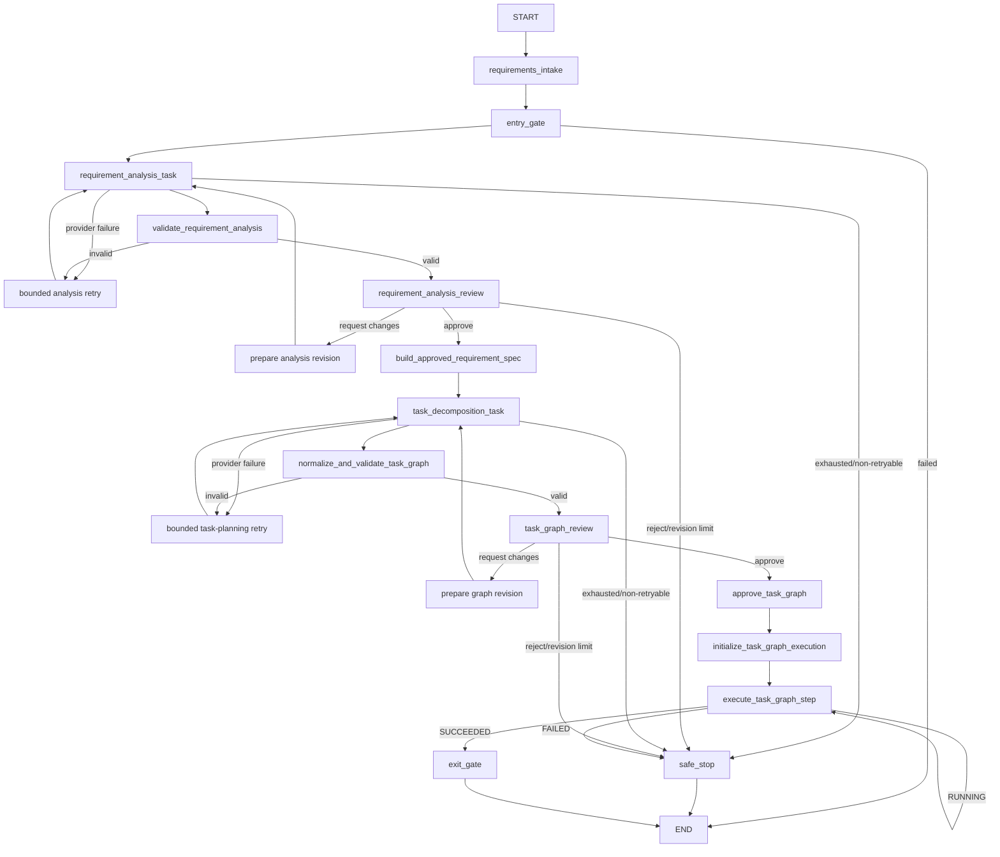

# Agentic SDLC Orchestrator

This repository incrementally demonstrates controlled, auditable execution across
the software-development lifecycle.

## Version progression

- **V0.1 — LangGraph orchestration foundation:** explicit sequential and parallel
  control flow, synchronization, gates, state, trace, and artifacts.
- **V0.2 — Stateful human governance:** checkpointed APPROVE,
  REQUEST_CHANGES, REJECT, bounded revisions, and safe stop.
- **V0.3 — Governed LLM requirement reasoning:** schema-backed requirement
  analysis, deterministic validation, human revision, and decision lineage.
- **V0.4 — Governed LLM task planning:** a human-approved requirement
  specification, LLM-proposed engineering task dependencies, deterministic graph
  normalization/validation, and human TaskGraph approval.
- **V0.5 — Governed TaskGraph execution runtime (current slices):** separate
  execution state, deterministic readiness and transitions, application-owned
  contracts and artifacts, a bounded OpenAI executor, and a static governed loop
  that interprets the approved engineering TaskGraph through bounded parallel
  execution waves.

The current V0.5 slices execute approved engineering tasks as bounded semantic
LLM calls and settle their runtime status from deterministic application
validation. They deliberately do **not** write generated outputs into project
source paths, run commands, perform Git operations, use fallback models, or
implement the URL Shortener demonstration service.

## Two distinct graphs

The governed design keeps two graph concepts separate.

### Orchestration / control graph

The static application workflow is implemented with LangGraph. It owns routing,
bounded planning retries and revisions, human interrupts, safe-stop behavior,
checkpointed state, execution-loop iteration, and the exit gate. The LLM never
creates or changes LangGraph nodes or routes.



Both human checkpoints use LangGraph `interrupt()` and a process-local
`InMemorySaver`; the CLI resumes the same thread with `Command(resume=...)`.
Interrupted state survives within the current process, not across process restarts.

### Engineering task dependency graph

The `TaskGraph` is a dynamic per-run domain artifact. The LLM proposes semantic
tasks and dependencies using temporary keys. Application code assigns authoritative
identity, validates references and the DAG, derives graph semantics, and a human
approves the result. V0.5 interprets it as dynamic data through a fixed LangGraph
execution loop; TASK-### records do not become LangGraph nodes.

Connectivity is represented once through `Task.depends_on`. Topological order,
execution layers, naturally parallel tasks, ENTRY-ready tasks, EXIT predecessors,
and synchronization points are derived rather than stored as competing
authoritative graph copies.

### Deterministic execution runtime foundation

The execution runtime keeps mutable progress separate from the immutable approved
plan:

```text
approved TaskGraph
    -> TaskGraphExecutionState
    -> deterministic readiness and synchronization transitions
```

Tasks without dependencies initialize as `READY`; dependent tasks initialize as
`BLOCKED`. Starting a ready task moves it to `RUNNING` and increments its attempt
count. Successful completion unlocks a blocked task only after every declared
dependency has succeeded. A task failure marks the graph execution `FAILED` and
freezes new dispatch. Already-running peers may settle without unlocking more
work; failure remains sticky, and `SAFE_STOPPED` requires no task to remain
`RUNNING`. Slice 5 adds a controlled `RUNNING -> READY` recovery transition;
`start_task()` remains the only operation that starts and counts a new attempt.

Multiple tasks can be ready at once. The scheduler selects at most
`MAX_PARALLEL_TASK_EXECUTIONS = 2` in canonical TaskGraph order, starts the whole
authorized wave through the existing governed transition, and joins that wave
before the next scheduler decision.

### Execution contract and artifact boundary

The deterministic contract layer itself stops before scheduler settlement:

```text
TaskExecutionRequest
    -> TaskExecutor
    -> TaskExecutionResult
    -> EngineeringArtifact(s)
    -> TaskExecutionValidationResult
    -> judgment returned to the control plane
```

`TaskExecutionRequest` is application-owned context for one already-running task
attempt. UUIDv5 request and attempt identities are derived from the approved spec,
graph, task, and attempt number. Every request contains the approved normalized
problem statement, requirement type, and assumptions, plus only the canonical
FR/NFR/CON/AC/RISK/AMB items referenced by that task. It does not contain the raw
conversation or requirement-analysis history. Dependency artifacts must be
canonical outputs from the current successful attempt of a declared direct
dependency; arbitrary or transitive artifacts are rejected.

`TaskExecutionResult` is a non-authoritative semantic proposal. It may contain a
summary, typed logical outputs, assumptions, and risks, but it cannot declare task
success or assign canonical IDs, lineage, hashes, or runtime state. Application
code converts each output into an immutable `EngineeringArtifact`, preserving
content while assigning provenance, an attempt-specific artifact ID, and a stable
artifact-slot lineage based on task lineage, output ordinal, type, and logical
name. Semantic cross-attempt reconciliation after output reordering or renaming is
deferred.

An artifact content hash covers canonical output content and authoritative
spec/graph/task/request/attempt/reference provenance, including output ordinal. It
excludes the application-supplied creation timestamp and the derived artifact and
lineage IDs. Artifact production does not equal acceptance: deterministic
`TaskExecutionValidationResult` records the separate judgment and the exact ordered
artifact IDs it evaluated, and no `accepted` flag is stored on the artifact. A
source task's `SUCCEEDED` runtime state is necessary but not sufficient for its
artifacts to become downstream context. The request builder also requires matching
successful validation evidence for each dependency's complete canonical artifact
set; missing, failed, partial, extra, stale, or mismatched evidence is rejected.
Every declared direct dependency requires evidence, including an explicitly
validated empty artifact-ID set when it produced no artifacts; omitting both its
artifacts and validation is not evidence of an empty accepted output. Fan-in
context is ordered by declared dependency and then canonical output order.

Initial validation checks correlation, required output presence, nonblank logical
names and contents, canonical artifact count, provenance, identity/hash integrity,
and output correspondence. V0.4 `expected_outputs` values are free-form descriptive
obligations, so this slice requires at least one output when obligations exist but
does not claim semantic one-to-one matching. A `SOURCE` artifact remains data only;
it is not written to the repository. No filesystem or shell execution exists in
this slice.

### Target-workspace desired-state contracts

The orchestrator control plane is conceptually separate from the target engineering
repository and any future disposable run workspace. Immutable, in-memory
`WorkspaceSnapshot` records bind proposals to an explicit `workspace_id`, base
snapshot identity, and canonically ordered repository-relative file hashes. A
snapshot may describe an empty greenfield repository or an existing brownfield
repository; constructing one performs no filesystem reads.

For a validated canonical `SOURCE` artifact, `logical_name` is interpreted as a
candidate repository-relative POSIX path and `content` as the complete desired file
contents. Trusted application code validates the path and derives `CREATE`,
`MODIFY`, or `NO_CHANGE` by comparing the desired-content SHA-256 with the bound
snapshot. The executor cannot choose an operation, preimage, workspace identity, or
change-set identity. An immutable `WorkspaceChangeSet` preserves task-attempt and
artifact provenance, and a separate `WorkspaceChangeSetValidationResult` checks
lineage, policy, hashes, operation derivation, ordering, and optimistic preimages.
`TaskExecutionValidationResult` retains its distinct executor/artifact-validation
responsibility.

The initial path policy rejects absolute and drive-qualified paths, backslashes,
NULs, empty/dot/traversal segments, duplicate destinations, `.git`, exact `.env`,
`.venv`, and `venv`; `.env.example` remains legal. Logical validation cannot prove
runtime symlink containment. The future filesystem backend must enforce containment
against the real workspace immediately before mutation.

Parallel change sets remain isolated desired-state records. Same-path proposals are
sorted and reported deterministically: two `NO_CHANGE` observations are compatible,
while any overlap containing `CREATE` or `MODIFY` fails closed, even for identical
desired contents or mutation plus `NO_CHANGE`. No AI merge or completion-order
selection occurs. This slice performs no writes, deletes, copying, Git operations,
shell execution, or task-settlement integration; transactional mutation and
postimage verification remain deferred.

### Bounded LLM task-executor adapter

The first provider adapter preserves the contract boundary:

```text
TaskExecutionRequest
    -> OpenAITaskExecutor
    -> TaskExecutionResult
```

`OpenAITaskExecutor` makes one structured-output request using the existing
`OPENAI_MODEL` configuration. Its fixed instructions and deterministic input are
derived only from the authoritative request: approved global and task-scoped
requirement context, the canonical current task, accepted direct-dependency
artifacts, and correlation IDs. Raw conversation history, unrelated requirements,
unrelated tasks, and arbitrary workflow state are excluded.

All governed OpenAI Responses calls explicitly set `store=False`, requesting that
generated Responses objects not be stored for later retrieval through the Responses
API. This does not disable the orchestrator's own canonical artifacts or audit
state, and it makes no broader claim about provider-side data handling.

All default governed OpenAI clients for requirement analysis, task planning, and
task execution explicitly use `max_retries=0`. Each application attempt therefore
maps to one SDK/provider invocation, keeping every retry decision explicit at the
orchestrator layer instead of hidden inside the SDK. Injected caller-owned clients
are used as supplied.

Approved FR/NFR/CON/AC items are authoritative engineering obligations, including
constraints or acceptance criteria written in imperative form. Approved assumptions
are authoritative premises; risks are authoritative engineering considerations;
and ambiguities are authoritative unresolved context. An approved ambiguity is
preserved unless the governed task or other approved context explicitly resolves
it. Accepted dependency artifacts remain authoritative engineering input from
predecessor tasks.

All bounded context remains unchanged. Embedded meta-instructions cannot redefine
the executor's role, capabilities, application policy, governance authority, output
contract, or permission for external actions: fixed system instructions define
executor-control authority, while the canonical task defines work scope.

The returned `TaskExecutionResult` remains a non-authoritative semantic proposal.
The executor cannot declare success or assign canonical artifact identity,
lineage, hashes, provenance, or runtime state. Application code still performs
artifact canonicalization and deterministic validation separately. The adapter
does not retry internally, write artifacts to the repository, run commands, or
settle task or graph state. One `TaskExecutor.execute()` invocation remains exactly
one provider attempt. The static LangGraph loop invokes the adapter and, outside
it, uses the validation judgment and deterministic recovery policy to settle
runtime state.

### Governed bounded-parallel TaskGraph execution loop

Human TaskGraph approval grants bounded semantic execution authority because the
executor still has no repository, shell, Git, deployment, or external-system side
effects. Approval enters this fixed lifecycle:

```text
approved TaskGraph
    -> initialize immutable runtime state
    -> select a bounded READY wave in canonical order
    -> start every authorized wave member
    -> build authoritative TaskExecutionRequests sequentially
    -> invoke TaskExecutor concurrently for prepared requests
    -> join every authorized peer
    -> canonicalize, validate, and classify in canonical order
    -> settle deterministically
    -> next wave / success / quiescent safe stop
```

LangGraph topology remains static while the approved engineering graph remains
dynamic per-run data; no `TASK-###` record becomes a LangGraph node. Only
`TaskExecutor.execute()` calls run concurrently in a bounded standard-library
thread pool. Request construction, state mutation, canonicalization, validation,
recovery classification, and scheduler settlement remain single-threaded. The
control plane persists requests, results, artifacts, validations, failures, and
recovery decisions in canonical wave order, so physical completion timing cannot
change audit order.

The control plane selects complete successful validation and artifact evidence for
each direct dependency, and the request builder independently revalidates that
evidence. A terminal peer failure freezes new dispatch but does not cancel or erase
already-authorized peers; they finish and settle before safe stop. There is no
fallback model, task cancellation, production timeout, delayed backoff, or
work-conserving mid-wave dispatch.

`TaskExecutor` implementations used by parallel dispatch may receive concurrent
`execute()` calls for independent attempts. Custom implementations and injected
clients are responsible for their own concurrency safety. The default
`OpenAITaskExecutor` creates a separate default OpenAI client per invocation when
no client is injected; SDK retries remain disabled and each task attempt still
maps to exactly one governed provider invocation.

### Bounded task-attempt recovery

One task is not necessarily one attempt: one `TaskExecutor.execute()` call is
exactly one attempt, and a task may receive at most three attempts (the original
attempt plus up to two retries). The application—not the LLM—classifies the failure
and chooses `RETRY` or `FAIL_TASK`. Request-build and application-invariant failures
are non-retryable; typed transient provider errors, result-correlation defects, and
an explicit allowlist of correctable validation checks may retry. Unknown failure
types default to non-retryable.

Every retry starts through the same deterministic scheduler order with a new
attempt ID and request ID. The new request carries only application-owned context
explaining why the immediately prior attempt did not complete successfully. When
that feedback identifies a correctable semantic-output defect, the next attempt
corrects it while executing the same approved task. When an executor failure
produced no usable output, the next attempt re-executes that task without inferring
new engineering requirements, constraints, or decisions. Retry context does not
include rejected result or artifact content and cannot change task scope,
requirements, dependencies, ambiguity authority, or executor capabilities. No
fallback provider, sleep, backoff, timer, or internal executor retry exists.

Failed requests, semantic results, canonical artifacts, validations, provider
failure records, and recovery decisions remain append-only audit evidence. Failed
artifacts never gain an `accepted` flag and never enter downstream context. If a
task eventually succeeds, only its final successful attempt and exact passed
validation artifact set may feed dependents. Exhausting attempt three records a
terminal decision, marks the task and graph failed, and uses the existing safe-stop
transition. Parallel readiness is still understood while actual dispatch remains
bounded by deterministic execution waves. A retry becomes a later wave attempt in
the same canonical scheduler order.

The prior V0.4 `architecture_task`, `test_plan_task`, and `synchronize` demo
branches and their obsolete state were removed: they generated canned examples and
would compete with the approved TaskGraph once real semantic task execution begins.
Architecture, source, test, and documentation proposals now originate only from
approved TASK-### execution and remain canonical data rather than repository writes.

## Governed planning and lineage

After requirement-analysis approval, deterministic code packages the exact
approved text into an immutable `ApprovedRequirementSpec`. There is no second LLM
rewrite between approval and specification creation.

The application assigns these human-readable namespaces:

- `FR-001`, `FR-002`, ... — functional requirements
- `NFR-001`, ... — nonfunctional requirements
- `CON-001`, ... — constraints
- `AC-001`, ... — acceptance criteria
- `RISK-001`, ... — risks
- `AMB-001`, ... — approved unresolved ambiguities

Each item also receives a deterministic application-generated lineage UUID. Its
initial identity includes the namespace, canonical item ID, and exact text, so two
same-namespace items with duplicate text still have distinct lineage IDs. Future
cross-version semantic reconciliation is deliberately deferred. Text is copied
exactly from the approved analysis.

The spec has a version, content hash, creation timestamp, optional predecessor ID,
and source analysis revision. A content hash covers the canonical hashed payload,
including its source provenance and application-assigned identities; it excludes
version-envelope fields such as timestamp, version, and predecessor. `SPEC-...-V001`
or `GRAPH-...-V002` identifies a specific immutable artifact version, while its
lineage UUID connects deliberately related versions.

The task planner receives only this approved specification. It may propose task
titles, descriptions, types, temporary keys, dependencies, traceability references,
and expected outputs. It cannot assign `TASK-###`, graph IDs, lineage IDs,
timestamps, hashes, versions, layers, ENTRY/EXIT tasks, approval state, or execution
state.

Deterministic normalization maps proposal order to `TASK-001`, `TASK-002`, and so
on, remaps temporary dependency keys, and assigns stable task lineage from the graph
lineage plus semantic key. Validation rejects duplicate keys/IDs, missing or self
dependencies, cycles, invalid specification references, and graphs without valid
synthetic ENTRY/EXIT semantics. Invalid graphs never reach human review.

Core traceability is bidirectional: every task reference must resolve to the
approved specification, and every approved FR, NFR, CON, and AC item must be
covered by at least one task. Missing coverage enters the bounded task-planning
retry path and cannot be human-approved as structurally complete. RISK and AMB
references are validated when present, but complete risk/ambiguity disposition is
intentionally deferred until a later milestone has an explicit disposition model.

An approved ambiguity remains explicit. For example, `AMB-001: URL expiration is
unspecified` can support a task to resolve that policy; the planner is instructed
not to silently replace it with a made-up 30-day expiration rule.

TaskGraph review supports APPROVE, REQUEST_CHANGES, and REJECT. Requested changes
preserve feedback and the prior validated graph, receive a fresh three-attempt
machine retry budget, create a new immutable graph version, and return to review.
Human graph revisions are separately limited to three. Rejection or exhaustion
safe-stops without executing tasks.

The models include versions, content hashes, lineage IDs, and optional predecessor
IDs so a future milestone can represent `SPEC-v1 -> GRAPH-v1` followed by
`SPEC-v2 -> GRAPH-v2` without mutating history. V0.4 does not implement upstream
change reconciliation or execution-state migration.

## Setup and run

Python 3.13 or newer is required.

```bash
python3 -m venv .venv
.venv/bin/python -m pip install -e ".[dev]"
cp .env.example .env
```

Set a real `OPENAI_API_KEY` in the ignored local `.env`. `OPENAI_MODEL` defaults
to `gpt-5.6-luna`. The project does not load `.env` itself, so export it before the
interactive demo:

```bash
set -a
source .env
set +a
.venv/bin/python -m agentic_sdlc demo
```

The CLI presents the full requirement analysis first. After requirement approval,
it displays the canonical specification namespaces, TaskGraph tasks and links,
derived execution layers, parallelism, joins, and ENTRY/EXIT semantics. It then
pauses for separate TaskGraph approval. REQUEST_CHANGES feedback at either stage
may span multiple lines and ends with a blank line.

Missing credentials never trigger a fake fallback. A missing task-executor key is
classified non-retryable, records a clear failure, and safely stops.

Successful artifacts are written under `artifacts/demo-run/`:

```text
requirements.json
requirement_analysis.md
approved_requirement_spec.json
task_graph.json
task_graph.md
task_execution.json
engineering_artifacts.json
summary.md
```

`task_graph.json` is the canonical graph. `task_graph.md` is a human-readable view
that includes derived layers, execution status, and governance history.
`task_execution.json` retains runtime snapshots and immutable execution-wave
membership plus correlated requests, results, validations, failures, retry
contexts, and recovery decisions;
`engineering_artifacts.json` contains immutable
application-canonicalized outputs, including failed-validation output for audit.
The checked-in `artifacts/demo-run/` snapshot is generated network-free through the
actual governed workflow using scripted requirement analysis, task planning, and a
concurrency-safe deterministic task executor with a fixed demonstration timestamp.
It includes an actual two-task executor wave plus one controlled retryable local
executor failure followed by a successful later attempt, without a provider call.
The generated
`artifacts/workflow_diagram.png` documents the static LangGraph control plane, not
the per-run engineering TaskGraph.

## Tests

```bash
.venv/bin/python -m pytest
```

Tests inject scripted `FakeRequirementAnalysisClient` and
`FakeTaskPlanningClient` instances plus deterministic task executors. They require
no API key or network access and
cover structured parsing, retries, safe stops, identity assignment, lineage,
reference integrity, DAG validation, derived parallel/join semantics, both human
approval loops, execution audit artifacts, and isolated deterministic TaskGraph
runtime transitions. Execution-contract tests additionally
cover approved-context filtering, direct dependency artifact flow, canonical
identity/provenance, executor trust boundaries, and separate validation.
Bounded-executor tests inject a fake Responses client and cover deterministic
input, one-call structured parsing, typed retryability, and invocation-failure
handling without a network connection. Static-loop tests use barriers and
thread-safe fakes to prove true two-task overlap, the concurrency cap, canonical
evidence ordering despite reversed completion, fan-out/fan-in dependency flow,
bounded recovery, terminal-peer settlement, and quiescent safe stop through actual
LangGraph routing. Workspace-contract tests cover deterministic logical snapshots,
SOURCE desired-state interpretation, conservative path policy, derived operations,
tamper detection, optimistic preimages, and order-independent parallel conflict
evidence without filesystem I/O.

## Deliberately deferred

The current V0.5 slice does not include cancellation, production task/wave timeout
policy, work-conserving streaming dispatch, fallback models or providers, delayed
retry/backoff policy, distributed workers, transactional workspace mutation,
repository copying or Git worktrees, DELETE support, generated-code execution,
repository-writing agents, dynamically generated LangGraph nodes, full dynamic
replanning, completed-task reconciliation, brownfield impact analysis, rollback,
skill loading, a persistent execution store, deployment, or a web UI.
