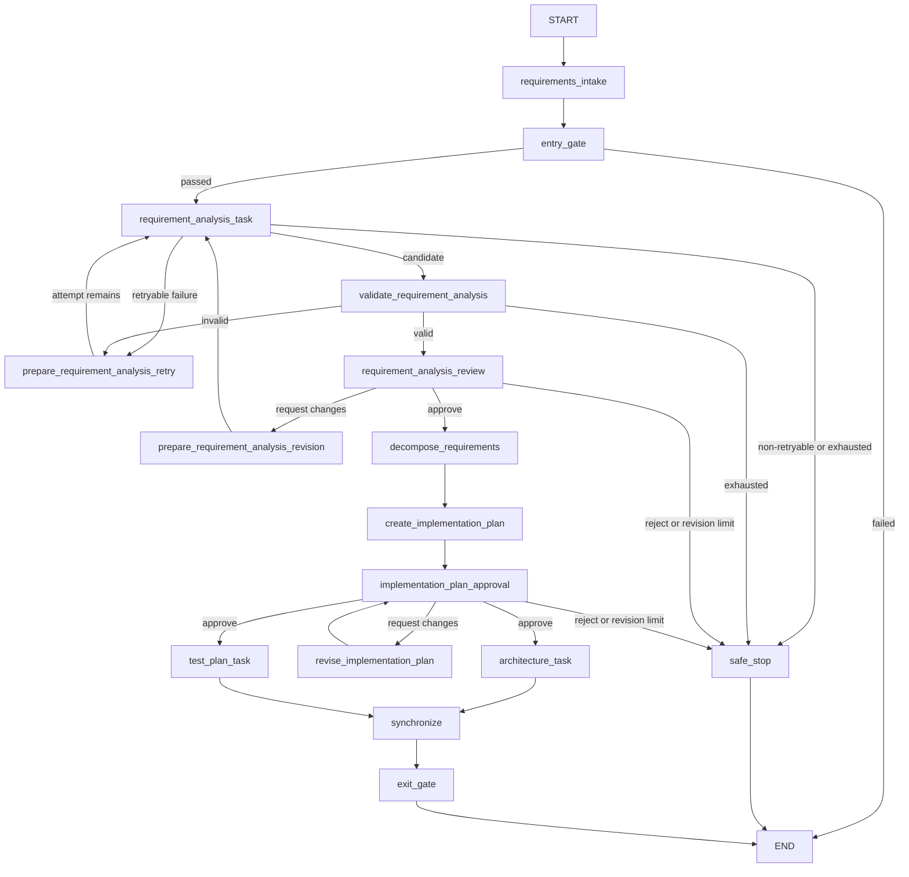

# Agentic SDLC Orchestrator

This repository is the foundation for an Agentic Software Engineering / SDLC
orchestration system. The long-term goal is controlled execution across
requirements, design, implementation, testing, documentation, release readiness,
and governance.

## V0.3 prototype

V0.3 introduces the project's first LLM-backed reasoning stage: a Requirement
Analyst converts the raw demonstration request into a validated, structured
engineering analysis. The result separates functional and nonfunctional
requirements, constraints, ambiguities, explicit assumptions, acceptance criteria,
risks, clarification needs, and confidence.

The LLM can propose an analysis, but it cannot approve itself or select a graph
route. LangGraph owns control flow, Pydantic defines the structural boundary,
deterministic retry/revision policies bound autonomy, and a human remains the
approval authority. A valid analysis therefore pauses at a real LangGraph
interrupt before deterministic decomposition and planning can begin.

The requirement reviewer may approve, request changes with feedback, or reject.
Requested changes preserve the earlier analysis and feedback, invoke the analyst
again, validate the revision, and return to the same review checkpoint. Provider
and schema failures have a separate three-attempt retry budget. Human-requested
analysis revisions are also limited to three. Rejection or exhaustion enters an
explicit safe stop with explanatory state and partial artifacts.

V0.3 preserves the V0.2 implementation-plan checkpoint. After requirement
approval, the deterministic workflow still decomposes requirements, creates a
plan, and pauses for a separate human plan decision. Plan approval fans out to the
existing parallel architecture and test-plan branches.

The built-in input remains a four-requirement **URL Shortener** scenario. The URL
shortener is only the engineering problem processed by the workflow; the service
itself is **not implemented**.

## Workflow



Both human checkpoints use LangGraph `interrupt()` plus a process-local
`InMemorySaver`. The CLI resumes the same thread with `Command(resume=...)`.
Interrupted runs therefore retain state within the current process, but do not
survive a process restart. The architecture and test-plan nodes remain separate
parallel branches; their multi-predecessor edge is the synchronization barrier.

## Setup and run

Python 3.13 or newer is required.

```bash
python3 -m venv .venv
.venv/bin/python -m pip install -e ".[dev]"
cp .env.example .env
```

Set a real `OPENAI_API_KEY` in the ignored local `.env`. The optional
`OPENAI_MODEL` defaults to `gpt-5.6-luna`. The project deliberately does not load
`.env` files itself, so export the variables into the shell before running:

```bash
set -a
source .env
set +a
.venv/bin/python -m agentic_sdlc demo
```

The CLI first displays the full structured requirement analysis and requests an
approve, request-changes, or reject decision. If approved, it later displays the
implementation plan for the existing second approval. Missing API credentials do
not trigger a fake fallback: the workflow records a clear, non-retryable failure
and stops safely without downstream planning.

When requesting changes at either review stage, enter one or more feedback lines
and finish the feedback with a blank line.

A successful V0.3 demo writes:

```text
artifacts/
├── workflow_diagram.png
└── demo-run/
    ├── requirements.json
    ├── requirement_analysis.md
    ├── decomposition.json
    ├── implementation_plan.md
    ├── architecture.md
    ├── test_plan.md
    └── summary.md
```

`requirement_analysis.md` records the current analysis, model and prompt version,
prior analysis revisions, and requirement-review decisions. `summary.md` includes
both requirement-review and implementation-plan approval history. A safe stop
writes only the artifacts for stages that actually completed.

The workflow PNG is generated from the actual compiled LangGraph `WORKFLOW` and
documents the orchestrator rather than one scenario. Diagram-rendering failure is
reported as a warning and does not change workflow status.

## Tests

```bash
.venv/bin/python -m pytest
```

The test suite injects `FakeRequirementAnalysisClient` with scripted structured
responses and failures. It makes no network requests, requires no API key, and
does not silently substitute that fake in normal runtime execution.

## Deliberately deferred

V0.3 limits LLM reasoning to requirement understanding. It does not provide LLM
task decomposition, implementation planning, architecture generation, test-plan
generation, code generation, autonomous repository modification, URL-shortener
implementation, generalized dynamic replanning, a persistence/database layer,
deployment, or a web UI. Those remain candidates for later milestones.
