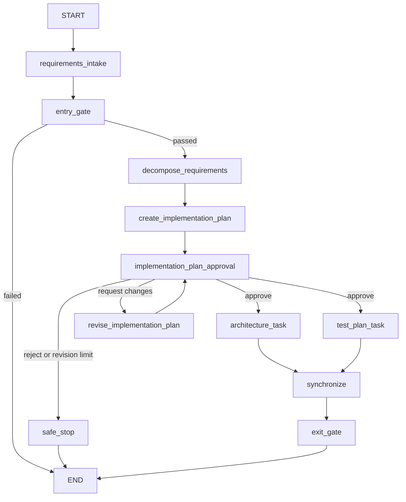

# Agentic SDLC Orchestrator

This repository is the foundation for an Agentic Software Engineering / SDLC
orchestration system. The long-term goal is controlled execution across
requirements, design, implementation, testing, documentation, release readiness,
and governance.

## V0.2 prototype

V0.2 adds stateful human governance to the V0.1 orchestration spine. The
implementation plan now requires an explicit human decision before architecture
and test planning can begin. LangGraph interrupts and checkpoints preserve the
workflow state while the CLI collects that decision, then resume the same run.
V0.2 uses LangGraph's process-local in-memory checkpointer, which is appropriate
for this prototype but does not preserve an interrupted run across process
restarts.

The checkpoint supports approval, rejection, or requested changes. Requested
changes are incorporated by a transparent deterministic revision node and return
to approval, with at most three revisions. Rejection or another change request
after that limit routes to an explicit safe stop. Every decision and its revision
number is retained in typed shared state and rendered in `summary.md`.

Every V0.2 node remains deterministic Python. This version does not call an LLM,
require an API key, or create autonomous coding agents; its purpose is governed,
stateful orchestration.

The built-in input is a four-requirement **URL Shortener** scenario. The URL
shortener is only the engineering problem processed by the workflow; the service
itself is **not implemented** in V0.2.

## Workflow



After the approval interrupt resumes with `APPROVE`, LangGraph schedules
`architecture_task` and `test_plan_task` as separate parallel branches. The graph
uses a multi-predecessor edge as a barrier, so `synchronize` becomes runnable only
after both branches finish. Each branch writes to its own state key.

`REQUEST_CHANGES` records the feedback and approval event, revises the plan, and
returns to the same checkpoint. `REJECT`, or a change request once all three
revisions have been used, records a reason and terminates through `safe_stop`
without running either downstream branch.

The entry gate routes invalid input directly to `END`, preventing decomposition
and all later work. The exit gate validates every expected output and marks the
workflow successful only when synchronization and all required artifacts are
present.

## Setup and run

Python 3.13 or newer is required.

```bash
python3 -m venv .venv
.venv/bin/python -m pip install -e ".[dev]"
.venv/bin/python -m agentic_sdlc demo
```

The demo displays the implementation plan and prompts for `[A]` approve, `[C]`
request changes, or `[R]` reject. Choosing changes also prompts for feedback.

The demo prints a concise node trace and writes these files under
`artifacts/demo-run/`:

- `requirements.json`
- `decomposition.json`
- `implementation_plan.md`
- `architecture.md`
- `test_plan.md`
- `summary.md`

The command also generates or refreshes `artifacts/workflow_diagram.png` from the
actual compiled LangGraph `WORKFLOW`. This PNG documents the orchestrator's
control flow and is separate from the scenario-specific `demo-run` artifacts.
A safely stopped run instead writes only the requirements, decomposition,
implementation plan, and summary so it does not imply downstream work occurred.

Run the tests with:

```bash
.venv/bin/python -m pytest
```

## Deliberately deferred

Later milestones are expected to introduce LLM-powered requirement analysis,
implementation and test agents, broader approval checkpoints, bounded retry and
fallback behavior, rollback controls, policy guardrails, durable persistence,
richer observability, reliability metrics, dynamic replanning, and greenfield,
brownfield, and ambiguous scenarios.

None of those future capabilities are claimed by V0.2. Its design principle is
**orchestration first, intelligence later**.
