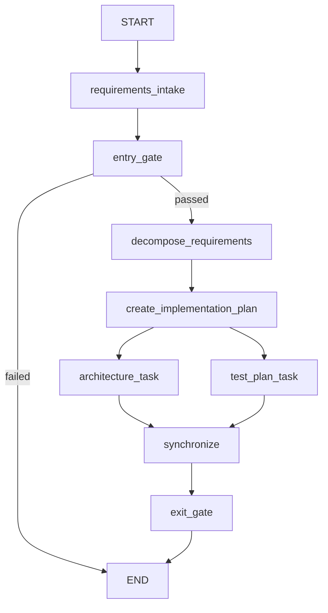

# Agentic SDLC Orchestrator

This repository is the foundation for an Agentic Software Engineering / SDLC
orchestration system. The long-term goal is controlled execution across
requirements, design, implementation, testing, documentation, release readiness,
and governance.

## V0.1 prototype

V0.1 proves the orchestration spine with an explicit LangGraph dependency graph,
typed shared state, entry and exit gates, sequential processing, parallel design
and test-planning branches, synchronization, a small execution trace, and
reviewable SDLC artifacts.

Every V0.1 node is a deterministic Python function. It does not call an LLM,
require an API key, or create autonomous coding agents.

The built-in input is a four-requirement **URL Shortener** scenario. The URL
shortener is only the engineering problem processed by the workflow; the service
itself is **not implemented** in V0.1.

## Workflow



After `create_implementation_plan`, LangGraph schedules `architecture_task` and
`test_plan_task` as separate parallel branches. The graph uses a multi-predecessor
edge as a barrier, so `synchronize` becomes runnable only after both branches
finish. Each branch writes to its own state key.

The entry gate routes invalid input directly to `END`, preventing decomposition
and all later work. The exit gate validates every expected output and marks the
workflow successful only when synchronization and all required artifacts are
present.

## Setup and run

Python 3.13 or newer is required.

```bash
python3 -m venv .venv
.venv/bin/python -m pip install -e ".[dev]"
.venv/bin/python -m agentic_sdlc demo
```

The demo prints a concise node trace and writes these files under
`artifacts/demo-run/`:

- `requirements.json`
- `decomposition.json`
- `implementation_plan.md`
- `architecture.md`
- `test_plan.md`
- `summary.md`

The command also generates or refreshes `artifacts/workflow_diagram.png` from the
actual compiled LangGraph `WORKFLOW`. This PNG documents the orchestrator's
control flow and is separate from the scenario-specific `demo-run` artifacts.

Run the tests with:

```bash
.venv/bin/python -m pytest
```

## Deliberately deferred

Later milestones are expected to introduce LLM-powered requirement analysis,
human approval checkpoints, implementation and test agents, bounded retry and
fallback behavior, rollback and safe-stop behavior, policy guardrails, richer
observability, reliability metrics, dynamic replanning, and greenfield,
brownfield, and ambiguous scenarios.

None of those future capabilities are claimed by V0.1. Its design principle is
**orchestration first, intelligence later**.
